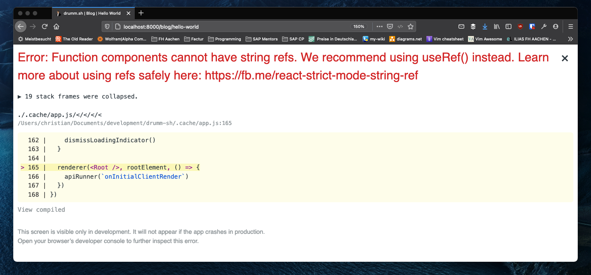
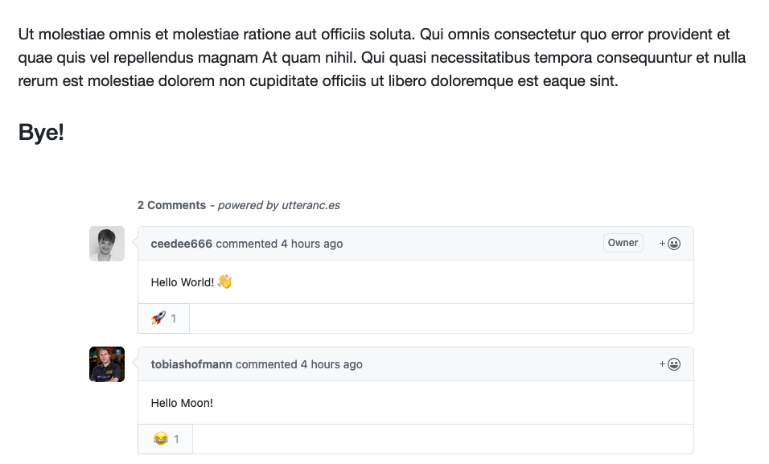

Allowing visitors to add comments to my blogs is a functionality, that was quite high on my product backlog from the start. Today I finally managed to add it. In this blog I describe
the problem I had implementing the feature using [Utterances](http://utteranc.es). My problem where mainly due to me being a Gatsby / React / JavaScript novice. Maybe this 
blog will help novices in the future.

## Comments Functionality

Allowing reads to comment is a quite common feature for blogging sites. In fact, it is so common, that the [Gatsby documentation](https://www.gatsbyjs.com/docs/) has an own
[section](https://www.gatsbyjs.com/docs/how-to/adding-common-features/adding-comments/) on adding comment. As described on that side there are many options
for adding comments to a Gatsby site. I didn't spent much time comparing the different options, but after briefly reviewing different options, [Utterances](https://utteranc.es/) look 
like a very promising option.

The nice feature of Utterances is, that [Github](https://github.com) issues are used to store comments. Therefore, adding a comment requires a Github user. While this might discourage 
some people from commenting, this is a very nice prerequisite in my case. As mention in a [previous blog](/why-i-creates-my-own-website) I want to use my web site and blog also
for teaching. Therefore, I can use the comment functionality in the future to introduce some Github features to students.

## Adding Utterances

The Utterances [website](https://utteranc.es/) contains actually a code generator to help adding the Utterances to a website. After the initial configuration steps and providing some
information an HTML fragment is generated. In my case the following fragment was generated:

```html
<script src="https://utteranc.es/client.js"
        repo="ceedeee666/drumm.sh-comments"
        issue-term="pathname"
        theme="github-light"
        crossorigin="anonymous"
        async>
</script>
```

The first thing I tried was adding this fragment to my Layout component. However, nothing happened. After some searching (not Googling as I use [DuckDuckGo](https://duckduckgo.com/) as 
my main search engine) I found out that one can't simply [add script tags to JSX](https://stackoverflow.com/questions/34424845/adding-script-tag-to-react-jsx/64815699). Further searching
revealed a list of blogs that describe how to add Utterances to a Gatsby / React site in detail. Here are just a few examples:

- https://divyanshu013.dev/blog/gatsby-comments-utterances/
- https://dev.to/creativcoder/how-to-add-comment-support-on-your-gatsby-blog-using-github-utterances-423n
- https://www.tiagofsanchez.com/blog/2020-12-01-comments-made-easy-with-utterances/
- https://dev.to/vincentntang/installing-gatsbyjs-blog-comments-using-utterances-1h8j

## Function components cannot have string refs

I basically followed the first [blog](https://divyanshu013.dev/blog/gatsby-comments-utterances/). The reasons are:

- I only used functional components so far in my site
- it contained all the functionality in one component. 

After implementing my Comments component I got the following error message: 

> Error: Function components cannot have string refs. We recommend using useRef() instead. 
> Learn more about using refs safely here: https://fb.me/react-strict-mode-string-ref.



## My Solution

Reading the React documentation on [Refs and the DOM](https://reactjs.org/docs/refs-and-the-dom.html) it was obvious I needed to use the ```useRef()``` function. 
After some experiments this is the solution I came up with (the complete source code of my site is available [here](https://github.com/ceedee666/drumm.sh)):

```javascript {numberLines}
import React, { useEffect, useRef } from 'react'
import { useStaticQuery, graphql } from 'gatsby'

const Comments = () => {
  const data = useStaticQuery(graphql`
    query RepoQuery {
      site {
        siteMetadata {
          commentsRepo
        }
      }
    }
  `)

  const commentsRef = useRef()

  useEffect(() => {
    const script = document.createElement('script')
    script.src = 'https://utteranc.es/client.js'
    script.async = true
    script.setAttribute('repo', data.site.siteMetadata.commentsRepo)
    script.setAttribute('issue-term', 'pathname')
    script.setAttribute('label', 'comment :speech_balloon:')
    script.setAttribute(
      'theme',
      'github-light'
    )
    script.setAttribute('crossorigin', 'anonymous')

    commentsRef.current.appendChild(script)

  }, [data])

  return (
    <div ref={commentsRef}/>
  )
}

export default Comments
```

The code cosists of the following parts:
- Line 5: Here I create a query to read the Github repository from the ```gatsby-config.js```.
- Line 15: Creates a Ref using the ```useRef()``` function.
- Line 17: The ```useEffect()``` functions builds the script element and adds it to the element identified by the ```commentsRef```. It is important to note
that the DOM element in the Ref is available using the ```.current``` attribute.
- Line 34: Finally, the ```<div>``` for the comments script is create and returned.


Whit this Comments component in place I can now add comment functionality to the pages of my website by just adding a ```<Comments />```. 

## Result

The following screenshot shows the final result. Already including some comment by [Tobias](https://twitter.com/tobiashofmann/).



I hope this blog will help other when trying to add Utterances to their Gatsby website. 

Christian
