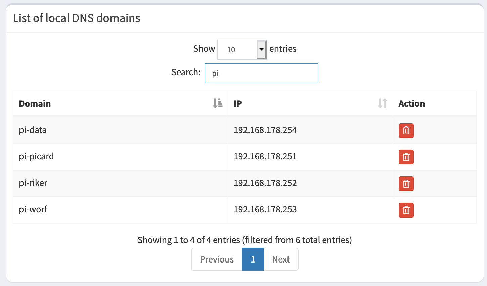

About a year ago I decided to build a [Raspberry PI](https://www.raspberrypi.org/). I can't remember 
anymore how I got the initial idea. Basically, I though it is a quite nice project. Furthermore,
I wanted to learn about technologies like [Kubernetes](https://kubernetes.io/) and
[OpenFaas](https://www.openfaas.com/).

Of cause there are lots of different options to learn Kubernetes besides building a physical
cluster:
- [Docker Desktop](https://www.docker.com/products/kubernetes) offers functionality to setup a local Kubernetes cluster
- [minikube](https://minikube.sigs.k8s.io/docs/) is a tools to "helping application developers and new Kubernetes users" in setting up a local cluster
- [AWS](https://docs.aws.amazon.com/eks/latest/userguide/getting-started-eksctl.html), 
[GCP](https://cloud.google.com/kubernetes-engine/docs/quickstart) and [Azure](https://docs.microsoft.com/en-us/azure/aks/intro-kubernetes) also provide the possibility to deploy Kubernetes clusters. 

Nevertheless, I decided to get my hands dirty 👷  and went ahead to build a Raspberry Pi cluster. In
this blog, which is hopefully the first in a series of blogs on the topic, I describe the necessary
steps to build the cluster and install the required software. 

## Bill of Materials

There are a large number of blogs on building Raspberry Pi based clusters (e.g. 
[here](https://magpi.raspberrypi.org/articles/build-a-raspberry-pi-cluster-computer), [here](https://magpi.raspberrypi.org/articles/clusterhat-review-cluster-hat-kit) or [here](https://www.raspberrypi.org/blog/five-years-of-raspberry-pi-clusters/)). 
I didn't do much research when building my cluster and just went for 
a straight forward setup with four Raspberry PIs. My cluster consist of the following components:

| Component | Amount | Link |
| --------- | ------ | ---- |
| Raspberry Pi 4 Model B, 4GB | 4 | [List of Resellers](https://www.raspberrypi.org/products/raspberry-pi-4-model-b/)|
| SanDisk Ultra 16GB microSD  | 4 | |
| Anker PowerPort 6 (6-Port USB charger) | 1 | [Anker Website](https://www.anker.com/products/variant/powerport-6/A2123123) |
| ICY BOX 4 Way Raspberry Pi 4 Case with Fan | 1 | |
| D-Link DGS-108 8-Port Switch | 1 | [D-Link Website](https://us.dlink.com/en/products/dgs-108-8-port-unmanaged-gigabit-metal-desktop-switch) |

Of cause, I also bought a set of network and USB cables. Furthermore, a SD card reader is required in 
order to install the operation system on the SD cards.

Building the cluster was very simple. The most complex part was assembling the ICY BOX case. However, after about 30 minutes this was finished as well and the cluster was nearly ready. 


## Installing the OS

Basically, it is possible to install every OS on a Raspberry Pi that supports the ARM architecture. For
novices the official Linux distribution Raspberry Pi OS (previously called Raspbian, available
[here](https://www.raspberrypi.org/software/) is the best choice. However, no novice ever tried to build
a cluster. So there are lots of different options to choose from. 

For my cluster I chose to install the latest development release of
[Ubuntu](https://ubuntu.com/download/raspberry-pi). At the time of writing this blog this was 
Ubuntu Server 20.10. Of cause, it would also be possible to use the desktop version of Ubuntu.
However, the cluster will mainly be accessed using different command line tools. 
Therefore, all the UI components of the desktop version would therefore never be used. 

Installing the OS is straight forward. There is also a large number of tutorial available on 
this topic. I simply followed the nice step by step 
[tutorial](https://ubuntu.com/tutorials/how-to-install-ubuntu-on-your-raspberry-pi) on the Ubuntu 
website. The only challenge when installing the OS was to execute the same steps four times. It would
also have been possible to clone the SD cards. However, I was lazy and just installed the OS four times.

Kubernetes requires [cgroups](https://en.wikipedia.org/wiki/Cgroups) being enabled. To enable 
cgroups add the following line to the ```boot/firmware/cmdline.txt```. 

```
cgroup_enable=memory swapaccount=1 cgroup_memory=1 cgroup_enable=cpuset
```

Once the SD cards are prepared with the OS it is time to insert them into the Raspberry Pis and power 
up the cluster for the first time!

### Configuring the OS

Once all Raspberry Pis are up and running there are a few configuration steps necessary. These steps are:
1. Change the default password of the ```ubuntu``` user
2. Set a hostname for each Raspberry Pi
3. (Optional) Copy SSH key to each Raspberry Pi

The first step ist to change the default password of the ```ubuntu``` user. In order to change the password
it is necessary to log on to each Raspberry Pi using SSH. To log on to the Raspberry Pis their IP addresses
are required. The installation [tutorial](https://ubuntu.com/tutorials/how-to-install-ubuntu-on-your-raspberry-pi)
describes one possibility how to identify the IP addresses of the Raspberry Pis. The default password 
for the user ```ubuntu``` is ```ubuntu```. On the first login Ubuntu asks to change this password. In my
cluster I used the same password for all four Raspberry Pis.

The next step is to set the hostnames of the Raspberry Pis. I used the following hostnames for my cluster:

- pi-picard
- pi-ricard
- pi-worf
- pi-data

As [Michael](https://twitter.com/rotnroll666/) pointed out on
[Twitter](https://twitter.com/rotnroll666/status/1358767107517906946?s=20) I missed the obvious
pi-card 🤦.

Setting the hostname in Ubuntu is done using the following command. After setting the hostname I rebooted 
the Raspberry Pis. However, this is not necessary.  
```bash
sudo hostnamectl set-hostname <new-computer-name-here>
sudo reboot
```

Finally, I copied my public SSH key to the Raspberry Pis to enable login without a password. I 
simply used my existing SSH key. Generation of an SSH key can be performed using the 
```ssh-keygen``` command on the local machine (not on the Raspberry Pis). Copying the public SSH
key to the Raspberry Pis is done using the following command:
```bash
sh-copy-id -i ~/.ssh/id_rsa ubuntu@<raspberry-pi-IP>
```

After this step the configuration of the OS is finished. Next I configured my local DNS to simplify
connecting to the RaspberryPis.

### Configuring local DNS

Accessing the Raspberry Pis using their IPs is quite cumbersome. This is especially true if due to the 
DHCP configuration the Raspberry Pis get different IP addresses on the local network all the time. 
Therefor I performed two configuration steps:

1. Configure a fixed IP address for each Raspberry Pi.
2. Added the hostnames to the local DNS server.

In the DHCP config of my local network I set gave each Raspberry Pi a fixed IP in the range 
192.168.178.251 - 192.168.178.254.

In my local network I already have a [Pi-hole](https://pi-hole.net/) instance running. Therefore, I could
simply add the hostnames of the Raspberry Pis to the local DNS configuration of the Pi-hole. After that, 
the Raspberry Pis were accessible using their individual hostnames.

. 

Note, that the last configuration step is very important. If the cluster nodes in an Kubernetes cluster
are not addressable using their hostnames, certain commands in the Kubernetes CLI don't work. It took
me quite a while to find out that the underlying reason for some of these error messages where due to 
the missing DNS configuration.

## Installing Kubernetes

The final installation step is the installation of Kubernetes on the Raspberry Pis. Again, there are 
different options available: 

- [Kubernetes](https://kubernetes.io/)
- [K3S](https://k3s.io/)
- [MicroK8s](https://microk8s.io/)

For no particular reason I chose MicroK8s for my cluster. MicroK8s can be installed in Ubuntu using 
the following command: 

```bash
sudo snap install microk8s --classic
```

Note, this command needs to be executed on all Raspberry Pis in the cluster. After this, the software
installation on the cluster is finished. To complete the setup, it is necessary to install the 
Kubernetes tools (i.e. kubectl) on the computer that will be used to control the cluster. Installation
instructions for different operating systems are available [here](https://kubernetes.io/docs/tasks/tools/).

## Outlook

After build the Raspberry Pi cluster and installing the necessary software the cluster is ready for usage.
The next step is to try out the different features of Kubernetes on the cluster. This will be described 
in the next blog of this series. 

Christian
