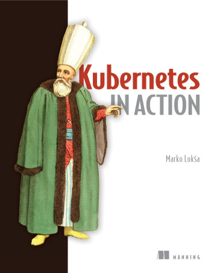
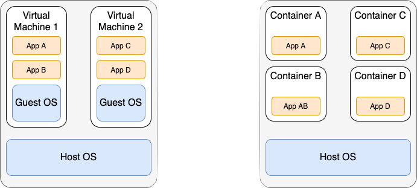

In this blog I descibed what I learned when trying to replicate the examples from the third 
chapter of the [Kubernetes in Action](https://www.manning.com/books/kubernetes-in-action) by 
[Marko Luksa](https://twitter.com/markoluksa). 



Unfortunately, I rarly stick to tutorials or descriptions in books. Most of the time I try to 
extend the examples just a little. This usually leeds me down the next rabbit hole. And after 
lengthy debugging session and lots of searching on the internet is usually haven't exactly achived 
what I wanted but also learnd lots of stuff along the way. This is exactly what happen in this case 😉!

## Python Echo Server

In order to have a litte application to deploy to my Kubernetes cluster I decided to implement an echo server. 
But in contrast to the echo server described in the Kubernetes in Action book I wanted to use Python 🐍 and 
[FastAPI](https://fastapi.tiangolo.com/) to implement the echo server. 

Implementing an echo server is straight forward with FastAPI. The following snippet shows my implementation. 
The code is also available on [Github](https://github.com/ceedee666/py-echo-server/blob/main/main.py).


```python {numberLines}
import uvicorn
import socket

from fastapi import FastAPI, Request

app = FastAPI()

@app.get("/")
async def root(request: Request):
  return {
    "client": request.client.host,
    "host": socket.gethostname(),
    "message": "Hello World from Python!"
  }

if __name__ == "__main__":
  uvicorn.run(app, host="0.0.0.0", port=8000)
```

The echo server can be run locally by executing ```python main.py```. Once the server is running 
sending an HTTP Get request to  it will return a simple JSON object containing client IP,
the host name and a message (cf. lines 11 - 13 in the code snippet).
Below is the output of running ```curl -s localhost:8000 | jq``` on my laptop.
Note that I use the ```-s``` option to supress progress output. Furthermore, the result is fromatted 
for better readabnility using [jq](https://stedolan.github.io/jq/).

```json
{
  "client": "127.0.0.1",
  "host": "Christians-MBP-2.local",
  "message": "Hello World"    
}
```


## Comparion between Virtual Machines and Containers

Before I continue with the explantion of how to depoly the echo server to Kubernetes it is important
to understand what containers are and how they differ from virtual machines.




## Creating a Docker Image

The next step is to create a [Docker](https://www.docker.com/) image containing the echo server. 


