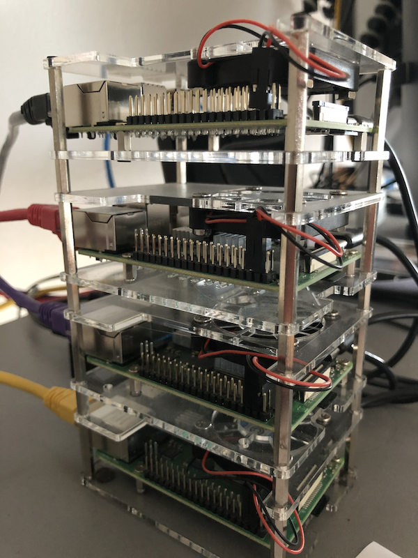
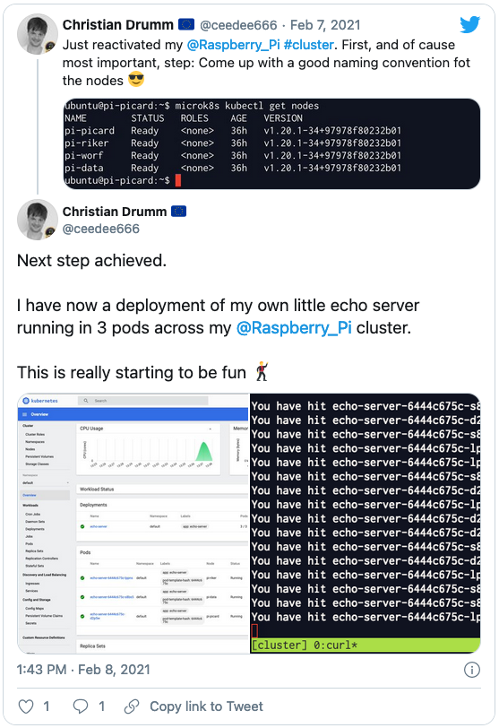

This is the first (of hopefully a lot more to come) post on my brand new [Website](https://drumm.sh). In this post I describe the journey that brought this
website into existence. Along the way I hope to clarify why building my first personal website was an inevitable choice.

## How it all started

Every journey starts with the first step. So what was this first step in my case? About a year ago after reading some of [Alex Ellis](https://twitter.com/alexellisuk) tweets
and blogs I decided to build a four node [Raspberry Pi](https://www.raspberrypi.org/products/raspberry-pi-4-model-b/) cluster. Here is a photo of the result:

However, this project went down the road of many personal projects. It ended up sitting half finished on my desk. After the winter term of 2020/2021 was finished a few weeks
ago I decided to reactive the cluster. After a few days I had it running on [MicroK8s](https://microk8s.io/) and was ready to start learning more about [Kubernetes](https://kubernetes.io/)
and [cloud native development](https://12factor.net/). This was about the time I published the following [tweet](https://twitter.com/ceedee666/status/1358758331544928256):

In the thread of this tweet [Frank](https://twitter.com/koehntopp) requested a blog on the topic. Furthermore, [DJ Adams](https://twitter.com/qmacro) encouraged me to blog even
if I don't understand everything i write about in full detail. So this was decided. I was going to write a blog about Kubernetes on my Raspberry Pi cluster.
At least such a blog would help me to remember what I did, which problems I encountered and how I was able to solve them.

## Why no SAP Community Blog?

In the past I would have simply written this blog in the [SAP Community](http://community.sap.com/). However, now I started thinking. There were several reasons for this:

1. The SAP Community is focused on SAP related topics. A blog on installing Kubernetes on a Raspberry Pi cluster doesn't really fit there.
2. I have several other topics in mind on which i want to write a blog. Most of them are related to my lectures at the [FH Aachen](http://ww.fh-aachen.de) and
would also not fit on the SAP Community.
3. In the last semester I asked two of my students to write a blog instead of taking an exam. They published these blogs on the SAP Community as well
([here](https://blogs.sap.com/2021/01/26/building-a-sap-cap-application-in-the-sap-business-application-studio-using-the-example-of-the-bundesliga-table/) and
[here](https://blogs.sap.com/2021/01/25/building-a-sap-cap-application-in-the-sap-business-application-studio-using-the-example-of-a-students-exam-registration/)). I'm really happy
with the result of this experiment and want to further expand it in the future. Again, the SAP Community doesn't seem to be the right place to post those blogs.

After one or two days I decided I needed a solution to write blogs. In my head I had collected the following requirements:

1. I want to be able to write blogs myself.
2. I want to easily allow my students to write blogs as well.
3. If possible I want to use [Markdown](https://en.wikipedia.org/wiki/Markdown) to write the blogs.
4. Ideally the new solution would offer some kind of integration with [Github](https://github.com/) for version control.

The last two requirements originated form some past experience. Firstly, I started writing my lecture materials using Markdown
and publishing them on Github (cf [End to End SAP ERP Process](https://github.com/ceedee666/erp_scp_end_2_end)). I really like using
Markdown and Github as it allows:

- me to quickly correct errors in the lecture material and publish the updated material
- enables students to submit improvements using pull requests.

Furthermore, I loath the Typo 3 installation we have a the FH Aachen. Creating and updating a personal website using it is just 🤬. Therefore, I
was sure i needed something different.

## Learning about the JAMStack (again)

At this point I sent a massage to [Oliver](https://twitter.com/oliver). He is basically the only *Web Dev person* I know. Although he has done
some real stuff, i.e. [ABAP](https://en.wikipedia.org/wiki/ABAP), in the past 😎. A few evening later we talk over Zoom and he recommended
[Gatsby](gatsbyjs.com/) and [Netlify](https://www.netlify.com/). After all, those are the tools he used to build [openSIT](https://opensit.net/).

After this chat I was sold on the idea of developing my own personal website using the [JAMStack](https://jamstack.wtf/).

### Gettings started with Gatsby

Getting started with Gatsby is quite easy. There are several good tutorials available. I worked trough the [The Great Gatsby Bootcamp](https://www.youtube.com/watch?v=8t0vNu2fCCM).
After that I felt ready to go. And then I went through the usual loop many times:

1. I have an idea 
1. It's more complex then I thought 🤔
1. I hate programming ☹️
1. *I hate programming* 😖
1. **I hate programming** 🤬
1. It works!
1. **I love programming** 😍
1. Goto 1.

### What I learned

First and foremost, developing using Gatsby is really fun. From creating the frist hello world app until the final style adjustments I liked the whole experience.
The main problems I ran into were due to me trying to learn 3 things in parallel. This site is built using:

- Gatsby and JavaScript
- Gatsby plugins
- Gatsby uses [Graphql](https://graphql.org/)
- [Bootstrap](https://getbootstrap.com/)
- [SCSS](https://sass-lang.com)

Besides JavaScript, I didn't know any of these technologies before. And my JavaScript skills are very bad as well. For everything I was able to
find solutions online. Once I read the solution to a problem it most of the time seemed obvious. So in the end I was able to build this website.
The source code is available [here](https://github.com/ceedee666/drumm.sh). If you notice any bad mistakes I'm looking forward to a pull request.

## What's Next?

There is still a lot of work to do. The sections for teaching and projects are still empty. However, the next term starts in about four weeks.
So at least the lecture section will need to contain some content soon. Furthermore, I hope to get back to regularly write blogs. I will start
with a blog series about my Raspberry Pi cluster soon. And then there are lots of functions missing which I want to add. For example there should be
the possibility to comment on blogs. I'm most likely going to implement it using [utterances](https://utteranc.es/). Let's see where this journey will lead.

Christian
