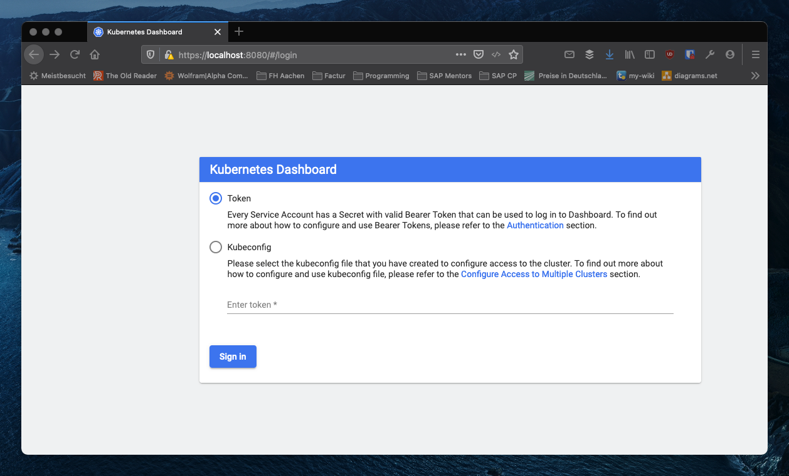
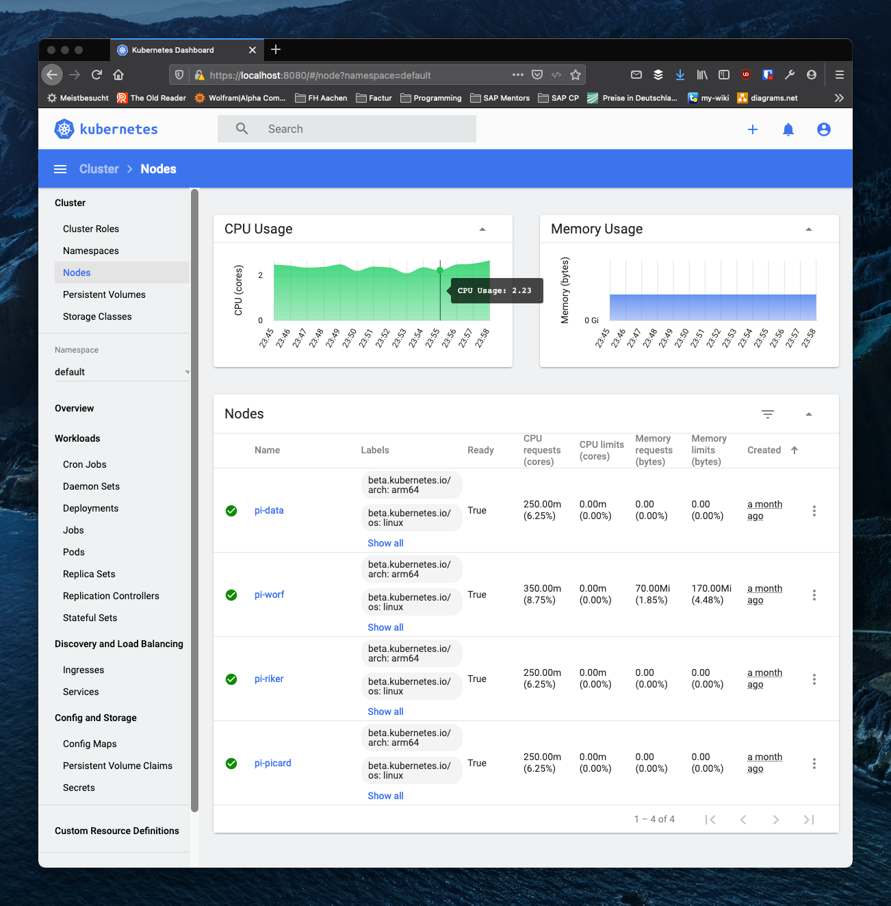

In the [previous blog](/blog/building-rpi-cluster) I described the initial steps to build and set up 
a Raspberry Pi cluster. With this initial setup in place, the next step is to connect the four Raspberry 
Pis together to form a Kubernetes cluster. 

## Creating a Kubernetes Cluster

As described in the [Kubernetes documentation](https://kubernetes.io/docs/concepts/overview/components/)
a Kubernetes cluster consists of the
[control plane](https://kubernetes.io/docs/reference/glossary/?all=true#term-control-plane) and 
several workers [nodes](https://kubernetes.io/docs/concepts/architecture/nodes/). The worker nodes 
execute the containerizes applications while the control plane is responsible for managing 
the worker nodes. The final configuration step in my Raspberry Pi cluster is to:

- Define which node acts as the control plane (Note: in a productive environment the control plane would
    also be running on several computers)
- Add the worker nodes to the control plane. 

Note, that the following description is specific for [MikroK8s](https://microk8s.io/). However, it should be 
easily adoptable to different Kubernetes variants. 

Defining the control plane and adding worker nodes to the cluster is that last time requiring to log 
into the individual Raspberry Pis directly. Once the cluster is set up all interactions with the 
cluster are performed using the [kubectl](https://kubernetes.io/docs/tasks/tools/), the Kubernetes CLI.

### Adding Worker Node

In my cluster the Raspberry Pi with the host name `pi-picard` is obviously going to run the 
control plane 🖖. To add worker nodes to a node it is necessary to log in using SSH
(e.g. `ssh ubuntu@pi-picard`). Once you are logged into the Raspberry Pi that is going to 
be the control plane execute the following command (caveat: this is specific for MikroK8s):

```zsh
microk8s add-node
```

The result of this command should be some joining instructions similar to the ones below:

```zsh
  From the node you wish to join to this cluster, run the following:
    microk8s join 192.168.178.251:25000/b5379006e31afba0056940b2ceea37f3

  If the node you are adding is not reachable through the default interface you can use one of the following:
    microk8s join 192.168.178.251:25000/b5379006e31afba0056940b2ceea37f3
    microk8s join 10.1.2.64:25000/b5379006e31afba0056940b2ceea37f3
```

Therefore, the next step is to log into the worker nodes (`pi-ricard`, `pi-data` and `pi-worf`)
in my case and the and execute the join command. Once the worker nodes are joined to the cluster, `kubnectl` can
be used to show the nodes in the cluster. 

In my cluster executing 

  ```zsh
  microk8s kubectl get no
  ```

results in the following output:

  ```zsh
  NAME        STATUS   ROLES    AGE   VERSION
  pi-data     Ready    <none>   30d   v1.20.2-34+c6851e88267786
  pi-riker    Ready    <none>   30d   v1.20.1-34+97978f80232b01
  pi-picard   Ready    <none>   30d   v1.20.2-34+c6851e88267786
  pi-worf     Ready    <none>   30d   v1.20.2-34+c6851e88267786
  ```

Furthermore, using `microk8s status` shows some additional information regarding the cluster:

  ```zsh
  microk8s is running
  high-availability: yes
    datastore master nodes: 192.168.178.251:19001 192.168.178.252:19001 192.168.178.253:19001
    datastore standby nodes: 192.168.178.254:19001
  addons:
    enabled:
      dashboard            # The Kubernetes dashboard
      dns                  # CoreDNS
      ha-cluster           # Configure high availability on the current node
      metrics-server       # K8s Metrics Server for API access to service metrics
    disabled:
      ...
```

This output shows that in my cluster the high availability is configured and the services `dns`, 
`dashboard` and `metrics-server` are running. Disabling and enabling service can also be
performed using the `microk8s` CLI. See the MicroK8s [documentation](https://microk8s.io/docs)
for further details. 

## Configuring kubectl

From this point on it is possible to interact with the Raspberry Pi cluster using the Kubernetes
CLI `kubectl`. In order to do so, `kubectl` needs to know on which server the control plane is
running and what user credential to use to access the cluster. This information is stored in the 
`kubeconfig` file. According to the 
[Kubernetes documentation](https://kubernetes.io/docs/concepts/configuration/organize-cluster-access-kubeconfig/)
the following process is used by `kubectl` to find the `kubeconfig`:

> By default, kubectl looks for a file named config in the $HOME/.kube directory. 
> You can specify other kubeconfig files by setting the KUBECONFIG environment variable 
> or by setting the --kubeconfig flag.

I chose to store the `kubeconfig` file for my cluster in a different location and set the 
`KUBECONFIG` environment variable whenever I want to interact with the cluster.

```zsh
export KUBECONFIG=~/Documents/development/rpi-cluster/kubeconfig
```

### Creating the kubeconfig File

The interesting question is which information `kubeconfig` file needs to contain. Again, there
are different approaches how to create a `kubeconfig` file. Especially, in more advanced scenarios 
than the one I described here, there are lots of different 
[features available](https://kubernetes.io/docs/tasks/access-application-cluster/configure-access-multiple-clusters/).

For my cluster I simply executed: 

```zsh
microk8s config
```

in the control plane node. The output of this command should look something like this:

```yaml
apiVersion: v1
clusters:
- cluster:
    certificate-authority-data: LS0tLS1CRUdJT...
    server: https://192.168.178.251:16443
  name: microk8s-cluster
contexts:
- context:
    cluster: microk8s-cluster
    user: admin
  name: microk8s
current-context: microk8s
kind: Config
preferences: {}
users:
- name: admin
  user:
    token: THNNNU...
```

Simply store the output of the command on the computer that is used to access the cluster and configure
`kubectl` to use it.

## Using kubectl

With the `kubeconfig` in place it is now possible to interact with the cluster using the 
`kubectl` command. 

### Adding a kubectl Shortcut

To interact with the cluster the `kubectl` command will be used a lot! As it in 
not exactly the shortest command to type it is useful to configure a shortcut for it. I simply added
the following alias to my ([ohmyz.sh](https://ohmyz.sh/)) shell config:

```zsh
alias k='kubectl'
```

With this alias in place I can now use `k` to invoke the `kubectl` command. For example executing
`k -h` results in the following output:

```zsh
kubectl controls the Kubernetes cluster manager.

 Find more information at: https://kubernetes.io/docs/reference/kubectl/overview/

Basic Commands (Beginner):
  create        Create a resource from a file or from stdin.
  expose        Take a replication controller, service, deployment or pod and expose it as a new Kubernetes Service
  run           Run a particular image on the cluster
  set           Set specific features on objects

```

### Accessing the Kubernetes Dashboard

In order to explore the Kubernetes cluster a little and get familiar with `kubectl`, the next
step is to access the Kubernetes Dashboard. The [Kubernetes Dashboard](https://kubernetes.io/docs/tasks/access-application-cluster/web-ui-dashboard/)
is a web application that can be used to manage the cluster. Accessing the Kubernetes Dashboard requires
a few steps:

1. Identifying the service name of the dashboard
2. Configuring port forwarding from the client to the cluster
3. Retrieving client secrets to access the dashboard.

#### Identifying the Service Name

`Kubectl` can be used to get the services running in the Kubernetes cluster. Executing 

```zsh
k get services
```

result in the following output in my cluster:

```zsh
NAME          TYPE           CLUSTER-IP      EXTERNAL-IP   PORT(S)          AGE
kubernetes    ClusterIP      10.152.183.1    <none>        443/TCP          30d
```

Obviously, the output does not contain the dashboard service. The reason is, that the dashboard service is deployed in a 
different namespace. Using `k get namespace` a list of all the namespaces in the cluster can be retrieved. In my cluster the 
following namespaces are available:

```zsh
NAME              STATUS   AGE
kube-system       Active   30d
kube-public       Active   30d
kube-node-lease   Active   30d
default           Active   30d
```

In MikroK8s the dashboard is deployed in the `kube-system` namespace. Executing

```zsh
k get services -n kube-system 
```

returns the services running in this namespace. In my cluster the command returns the following list of services.

```zsh
NAME                        TYPE        CLUSTER-IP       EXTERNAL-IP   PORT(S)                  AGE
metrics-server              ClusterIP   10.152.183.97    <none>        443/TCP                  30d
kubernetes-dashboard        ClusterIP   10.152.183.88    <none>        443/TCP                  30d
dashboard-metrics-scraper   ClusterIP   10.152.183.143   <none>        8000/TCP                 30d
kube-dns                    ClusterIP   10.152.183.10    <none>        53/UDP,53/TCP,9153/TCP   29d
```

#### Configuring Port Forwarding

Once the exact name and namespace of a service is know it is possible to configure port forwarding to this
service. The `kubnectl` [documentation]/(https://kubernetes.io/docs/tasks/access-application-cluster/port-forward-access-application-cluster/) contains
a detailed example how to use port forwarding to access applications running in the cluster. To access the Kubernetes Dashboard a port of the local machine 
needs to be forwarded to the appropriate service.

The following command forwards the local port `8080` to the port `443` of the service `kubernetes-dashboard` in the namespace `kube-system`.

```zsh
k port-forward -n kube-system service/kubernetes-dashboard 8080:443
```

Once the port forwarding is running it is possible to access the Kubernetes Dashboard at the URL https://localhost:8080. Accessing this URL in a
browser results in the login window shown below.



Login is possible by either selecting the `kubeconfig` file or providing a authentication token. 

#### Retrieving Secrets to Access the Dashboard

In order to further explore the possibilities of `kubectl` I will use the authentication token to access the dashboard. In order to read the correct
authentication token it is first necessary to find out which tokens exist. The following command returns a list of all secrets in the namespace
`kube-system`.

```zsh
kubectl -n kube-system get secret
```

Running this command returns a long list of available secrets. In my cluster the this is the first part of the returned list:

```zsh
NAME                                             TYPE                                  DATA   AGE
calico-node-token-spnt5                          kubernetes.io/service-account-token   3      31d
resourcequota-controller-token-6tc67             kubernetes.io/service-account-token   3      31d
calico-kube-controllers-token-p8dlv              kubernetes.io/service-account-token   3      31d
job-controller-token-lhkst                       kubernetes.io/service-account-token   3      31d
ttl-controller-token-m96b7                       kubernetes.io/service-account-token   3      31d
attachdetach-controller-token-kw5fg              kubernetes.io/service-account-token   3      31d
pod-garbage-collector-token-xrjns                kubernetes.io/service-account-token   3      31d
disruption-controller-token-bv46c                kubernetes.io/service-account-token   3      31d
```

In order to access the Kubernetes Dashboard a secret of type `service-account-token` is required. In my cluster the respective secret is called
`kubernetes-dashboard-token-ccpfl`. Using the following command this secret can be read:

```zsh
k -n kube-system describe secret kubernetes-dashboard-token-ccpfl
```

Executing the above command returns the following information:

```zsh
Name:         kubernetes-dashboard-token-ccpfl
Namespace:    kube-system
Labels:       <none>
Annotations:  kubernetes.io/service-account.name: kubernetes-dashboard
              kubernetes.io/service-account.uid: 11cca18d-288b-4166-b0fb-feb1d3e49053

              Type:  kubernetes.io/service-account-token

              Data
              ====
              ca.crt:     1103 bytes
              namespace:  11 bytes
              token:      eyJhbGciOiJSUzI1NiIsImtpZCI6InBsUVlzU...
```

Pasting the returned token into the login screen should provide access to the dashboard. The following screenshot shows the node overview of my cluster.



## Outlook

Accessing the Kubernetes Dashboard concludes this blog. In the next blog I'll describe how to build a small Node.js application and deploy it into
the cluster. 

Christian 
