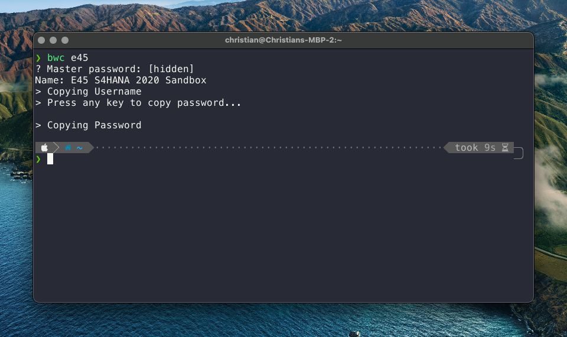
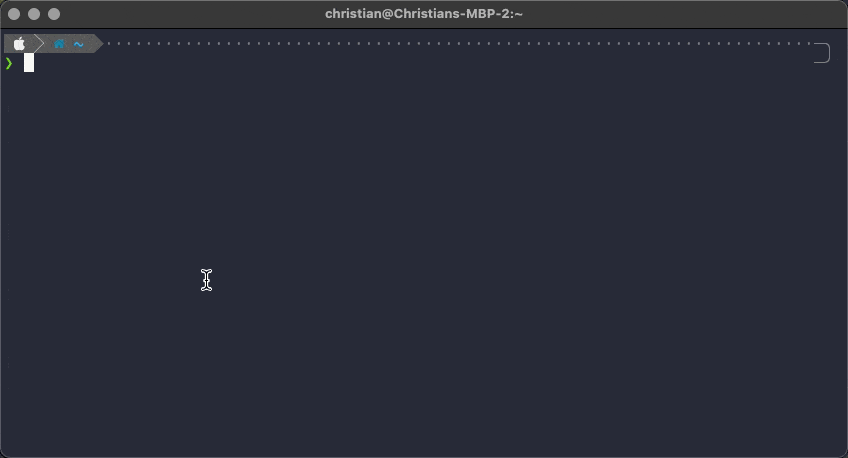
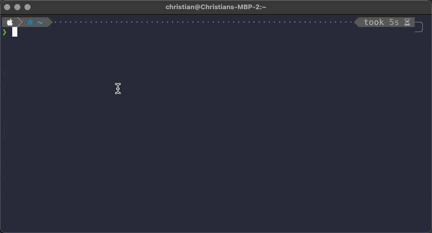

[Bitwarden](https://bitwarden.com/) has been my password manager of
choice since it was recommended to me by
[Frank](https://twitter.com/koehntopp) about two years ago. I
like most of its functionality. However, one thing kept annoying
me. To be honest this was already the case with my previous
password manager.

The integration of Bitwarden into the browser is great. When I'm
not in the browser the interaction with Bitwarden often felt
cumbersome. For example, I quite often work or in a
virtual machine running Windows<sup id="a1">[1](#f1)</sup> or in
the terminal in full screen mode. In order to get a password
from Bitwarden when I'm not in the browser I need to do the
following steps:

1. Switch to the browser
1. Click on the Bitwarden icon
1. Enter the master password (in most of the cases)
1. Enter a search string
1. Click on the icon to copy the password
1. Switch back to my work environment.

Especially, when working in the terminal, the need to suddenly
switch to using the mouse annoyed me.

## Bitwarden CLI

One of the nice features of Bitwarden is, that there is also
a [command-line interface](https://bitwarden.com/help/article/cli/) available.
I had a look at this CLI a few weeks back, but I
did not find it useful. With the ID of an entry in my
vault the Bitwarden CLI would allow me to look up the password
using

```zsh
bw get password <ID>
```

In order to get the necessary ID I could use

```zsh
bw list items <search-string>
```

However, the `bw list items` command returns a JSON string
containing all the information of the entries matching the
`<search-string>`. In particular, I didn't see an easy way to
get the ID from the results and use it to get the password. So
after playing with the CLI for about half an hour, I gave up.

## Shell Scripting to the Rescue

A few days ago I read the blog post [Bringing the Unix Philosophy to the 21st Century](https://blog.kellybrazil.com/2019/11/26/bringing-the-unix-philosophy-to-the-21st-century/)
by [Kelly Brazil](https://github.com/kellyjonbrazil) (found via
[@qmacro](https://twitter.com/qmacro/status/1429463349239197701) of cause).
After reading this post i thought: ["hold up, wait a minute"](https://youtu.be/XFoXmnBuLw0). The Bitwarden
CLI returns JSON. I have already used command-line tools [jq](https://stedolan.github.io/jq/) and
[fzf](https://github.com/junegunn/fzf) a bit. It should be possible
to adapt the Bitwarden CLI to my needs with those tools.

Of course, being a good software developer, I started with a Web search first. And, surprise,
I found a [blog post](https://benaaron.dev/blog/bitwarden-cli/) by Ben Aaron Goldberg that
describes almost exactly what I wanted to have. Using this blog post as a basis I was sure I
could create the CLI for Bitwarden that I needed.

### My Requirements

What features did I want to have in my bespoke Bitwarden CLI?

1. I want to be able to search for usernames and passwords using a search string
1. If only one entry is found, first the username and after that the password
for the entry should be copied to the clip board.
1. If more than one entry is found I want to be able to search through the
results and select the entry I was looking for. After that the username and
password should again be copied to the clip board.

The following screenshot shows what I had in mind for the CLI.



### My Solution

My requirements didn't sound overly complicated. So I stared building a shell script
implementing them. This is what I came up with after quite some trial and error.
I created a shell script called [bwc](https://github.com/ceedee666/devenv-dotfiles/blob/master/.scripts/bwc) -
a mnemonic for Bitwaren Copy.

```zsh {numberLines}
set -e

copy_uname_and_passwd () {
  # Print the name of the selected login
  echo "Name: $(printf "%s" "$1" | jq -r ".name")"
  echo "> Copying Username"
  # Copy the username to the clipboard
  printf "%s" "$1" | jq -r ".login.username" | pbcopy
  echo "> Press any key to copy password..."
  # Wait for user input before coping the password
  read
  echo "> Copying Password"
  # Copy the password to the clipboard
  printf "%s" "$1" | jq -r ".login.password" | pbcopy
}


# Search for passwords using the search term
logins="$(bw list items --search $1)"

if [ $(printf "%s" "$logins" | jq ". | length") -eq 1  ]
then
  login="$(printf "%s" "$logins" | jq ".[0]")"
else
  name="$(printf "%s" "$logins" | jq -r ".[].name" | fzf --reverse)"
  login="$(printf "%s" "$logins" | jq ".[] | select(.name == \"$name\")")"
fi

copy_uname_and_passwd $login

```

Lines 3 - 15 are mostly copied from the blog post mentioned above. The only thing
I did was wrapping it in a function that I could reuse.

The execution of the script starts in line 19. The Bitwarden CLI
is used to search for items using the search term passed to the
script as a parameter. The result is stored in the variable `logins`.

Next, the length of the resulting JSON array is calculated using
`jq ". | length"`. If only one entry is found, this entry is stored
in the variable `login` (line 23). If more than one entry is found
the names of these entries are passed to fzf. The name of the
selected entry is stored in the variable `name`. This variable is used
line 26 to get the selected login from the result array `logins` and
store it in the variable `login`.

Finally, the function `copy_uname_and_passws` is called with the
`login` as a parameter.

The following two GIFs show the script in action. First, with only
one result returned from the search:



Second, with multiple results returned by the search:



### Be careful with echo

One of the problems I was facing during development of the script was this
error message from jq:

```
parse error: Invalid string: control characters from U+0000 through U+001F must be escaped at line 6, column 13
```

After lots of trial and error I noticed the problem was the `echo` I was
using in the script. `echo` does some special handling of
characters like `\n`.

For example, initial line 21 contained the following code:

```zsh
$(echo $logins | jq ". | length")
```

Due to the special handling of `\n` the JSON piped from `echo` to `jq` was not valid. Once
I changed `echo` to `printf` everything worked as expected.

## Summary

I now have exactly the Bitwarden CLI I was looking for. Furthermore, creating the shell script
showed me, again, the power of the [Unix philosophy](https://en.wikipedia.org/wiki/Unix_philosophy)
of having a program do exactly one thing and do this well.

As this is my first shell script I'm sure there my things to improve. I would be happy
to hear any suggestions by some of the command-line and shell
scripting magicians 🧙‍♀️ out there.


---
<b id="f1">1</b> This is due to the fact that VMware doesn't have
a working version of its proprietary VPN solution for any recent
MacOS.[↩](#a1)
