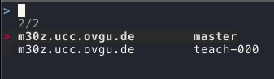
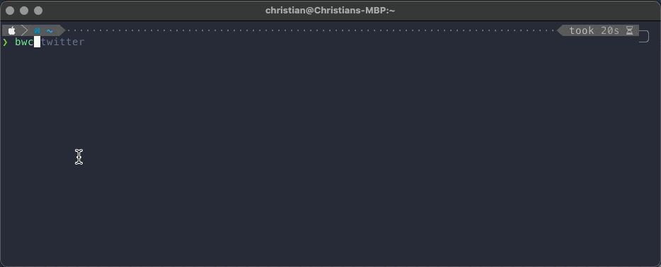

In my previous [blog post](/blog/2021/08/25/bw-cli) I started to explore shell scripting
by adapting the [Bitwarden](https://bitwarden.com/) [CLI](https://bitwarden.com/help/article/cli/)
to my needs. Luckily, [DJ](https://twitter.com/qmacro) and [markhepburn](https://github.com/markhepburn)
also wrote blog posts on the topic (cf. [here](https://qmacro.org/2021/08/26/learning-by-rewriting/)
and [here](https://blog.markhepburn.com/posts/automating-ssh-login-involving-totp-codes/)).
Based on their blog posts I tried a few more ideas. Finally, I was able to improve
my initial shell script a bit (at least in my opinion 😉).

## Additional Requirements

After reading DJ's and Mark's blog post I added the following requirements to
my [initial list](http://localhost:8000/blog/bw-cli#my-requirements).

1. If a [TOTP](https://en.wikipedia.org/wiki/Time-based_One-Time_Password) token
is available for an entry, my custom CLI should also copy this token.
1. Simply my shell script by using some to the features DJ used in his script.
1. Distinguish between different username / passwords for the same Web site.

These requirements didn't look like much work. However, especially the first
one required me to change the approach I took in the shell script.

## My New Solution

Before going into more details here is the resulting script.
The complete script is also
available on [GitHub](https://github.com/ceedee666/devenv-dotfiles/blob/master/.scripts/bwc).

```zsh {numberLines}
#!/bin/zsh

set -e

copy_data () {
  local id=$1
  local login=$2
  local sessionkey=$3
  local totp

  echo "Name: $(jq -r ".name" <<< $login)"

  # Copy the username to the clipboard
  echo "> Copying Username"
  jq -r ".login.username" <<< $login | pbcopy

  # Wait for user input before coping the password
  echo "> Press any key to copy password..."
  read

  # Copy the password to the clipboard
  echo "> Copying Password"
  jq -r ".login.password" <<< $login | pbcopy

  # Copy a TOTP Token if available
  totp=$(jq -r ".login.totp" <<< $login)

  if [[ $totp != "null" ]]; then
    # Wait for user input before coping the totp token
    echo "> Press any key to copy TOTP Token..."
    read
    echo "> Copying TOTP Token"
    bw get totp $id --session $sessionkey | pbcopy
  fi
}

main() {
  local searchterm=$1
  local sessionkey logins login id

  #Unlock the vault an store the session key
  sessionkey=$(bw unlock --raw)

  # Search for passwords using the search term
  logins=$(bw list items --search $searchterm --session $sessionkey)

  id=$(jq -r '.[] | "\(.name)\t\(.login.username)\t\(.id)"' <<< $logins \
    | fzf --reverse --with-nth=1,2 --delimiter="\t" --select-1 --exit-0 \
    | awk -F"\t" '{print $3}'
  )

  if [[ -n $id ]]; then
    login="$(jq ".[] | select(.id == \"$id\")" <<< $logins)"
    copy_data $id $login $sessionkey
  fi
}

main "$@"
```

## Main Function

The first change I implemented is to introduce a `main` function
(cf. lines 37 &ndash; 56).
This idea I copied directly from DJs [blog post](https://qmacro.org/2021/08/26/learning-by-rewriting/).
The execution of the script starts in line 58 by invoking this `main` function.
The special parameter `$@` is used to pass all parameters of the script to the
main function.

Besides that, I also qualified all the variables with `local`
(cf. lines 6 &ndash; 9 and 38 &ndash; 39). Also coping the positional
parameters (e.g. `$1` or `$2`) to a local variable at the beginning of the
function seems to be a good idea (cf. lines 6 &ndash; 8).

## Here String <<<

In the previous blog post I described how I ran into some
problems due to the handling of special characters like `\n` by
[echo](http://localhost:8000/blog/2021/08/25/bw-cli/#be-careful-with-echo).
My first solution was to use `printf` instead. In DJ's [blog post](https://qmacro.org/2021/08/26/learning-by-rewriting/)
I learned about [here strings](https://tldp.org/LDP/abs/html/x17837.html). I used
these in the new version of the script as well (e.g. lines 15, 23, 26 or 47).

However, currently I'm unsure if I like the syntax of here strings or of `printf`
better. The advantage of here strings is conciseness. The disadvantage in my
point of view is, that suddenly line can't be read from left to right anymore.
For example, line 15 could be nicely read from left to right using `printf`.

```zsh
# Copy the username to the clipboard
printf "%s" "$login" | jq -r ".login.username" | pbcopy
```

With the here string I need to read until the `<<<` in order to
understand where the input of `jq`is coming from. Nevertheless,
I stuck with the here strings for the new version of the script
just to get used to them.

```zsh
# Copy the username to the clipboard
jq -r ".login.username" <<< $login | pbcopy
```

## fzf-Features

In the initial script I used a conditional to distinguish between the
situations that one or many results are returned by the
search. This complexity is unnecessary and was removed in the current version
of the script. Instead, the parameter `--select-1` is used to tell
fzf to immediately return when only one element was passed.

In order to distinguish between logins with the same name and different
passwords, used the `--delimiter` parameter
DJ used in his [blog post](https://qmacro.org/2021/08/26/learning-by-rewriting/).

In the script the name, the login name and the id of the entries are passed to fzf
separated by a tab.
This input is generated using `jq` [string interpolation](https://stedolan.github.io/jq/manual/#Stringinterpolation-\(foo)).
For each entry returned by `bw list items` in line 45 a string consisting
of the name, a tab, the username, a tab and the id is generated.

```zsh
jq -r '.[] | "\(.name)\t\(.login.username)\t\(.id)"' <<< $logins

```

The `--with-nth=1,2` parameter tells fzf to only display the first two elements of the input.
The resulting invocation of fzf is shown in line 48. The following screenshot shows the
resulting user interface when the search returns multiple entries for the
same system with different user names.




## More Bitwarden CLI

The major changes of the new version of my script are related to the
[Bitwarden CLI](https://bitwarden.com/help/article/cli/)

Whenever the
password vault is locked and a command like [get](https://bitwarden.com/help/article/cli/#get)
or [list](https://bitwarden.com/help/article/cli/#list) is executed,
the [Bitwarden CLI](https://bitwarden.com/help/article/cli/) asks for the
password to unlock the vault. In my initial script
this was not a problem. It only accessed the fault once using `bw list <searchterm>`.
However, the JSON data returned by this command doesn't contain the current TOTP
token for an entry. To get a TOTP token `bw get totop <ID>` needs to be
executed with the ID of a vault entry. As I don't want to enter my password
multiple times for one entry in the password vault the script needs to use
the [log in](https://bitwarden.com/help/article/cli/#session-management) functionality
of the Bitwarden CLI.

This log in functionality consists of two steps. First, the password vault is unlocked
in line 42 using `bw unlock`. This command requires entering the password to unlock
the vault. If the correct password is entered, a session key is returned. In my script
this session key is then stored in the local variable `sessionkey`. For all subsequent
invocations of the Bitwarden CLI (cf. line 45 and 33), the session key is passed
to the command using the
`--session` parameter.

## Final Result

The following GIF shows the new script in action.



## Summary

Using what I learned from DJ I was able to improve my initial script quite
a bit. Right now I'm pretty happy with the result. Let's see if I'll continue
with more shell scripting in the future.

Christian
