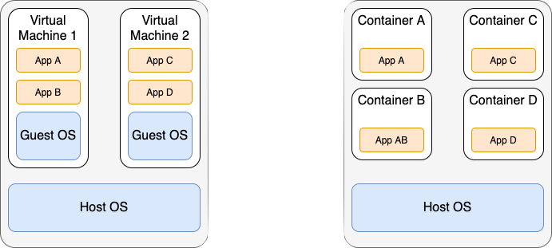
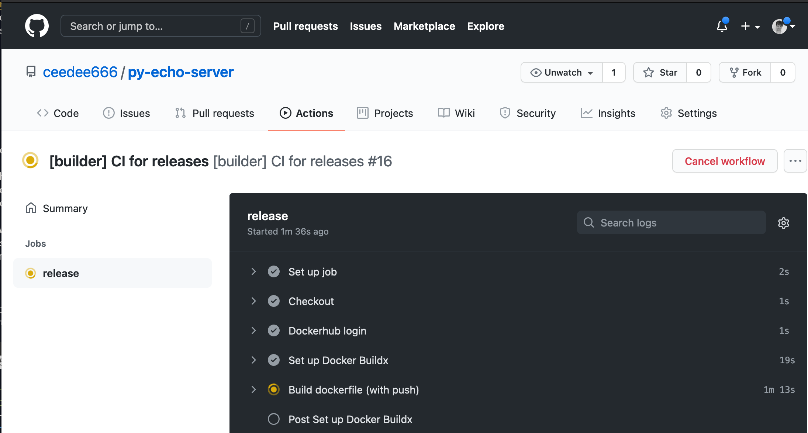

In this blog I described what I learned when trying to replicate the examples from the third 
chapter of the [Kubernetes in Action](https://www.manning.com/books/kubernetes-in-action) by 
[Marko Luksa](https://twitter.com/markoluksa). 


Unfortunately, I rarely stick to tutorials or descriptions in books. Most of the time I try to 
extend the examples just a little. This usually leads me down the next rabbit hole. And after 
lengthy debugging session and lots of searching on the internet is usually haven't exactly achieved 
what I wanted but also learned lots of stuff along the way. This is exactly what happen in this case 😉!

## Python Echo Server

In order to have a little application to deploy to my Kubernetes cluster I decided to implement an echo server. 
But in contrast to the echo server described in the Kubernetes in Action book I wanted to use Python 🐍 and 
[FastAPI](https://fastapi.tiangolo.com/) to implement the echo server. 

Implementing an echo server is straight forward with FastAPI. The following snippet shows my implementation. 
The code is also available on [Github](https://github.com/ceedee666/py-echo-server/blob/main/main.py).


```python {numberLines}
import uvicorn
import socket

from fastapi import FastAPI, Request

app = FastAPI()

@app.get("/")
async def root(request: Request):
  return {
    "client": request.client.host,
    "host": socket.gethostname(),
    "message": "Hello World from Python!"
  }

if __name__ == "__main__":
  uvicorn.run(app, host="0.0.0.0", port=8000)
```

The echo server can be run locally by executing `python main.py`. Once the server is running 
sending an HTTP Get request to it will return a simple JSON object containing client IP,
the host name and a message (cf. lines 11 - 13 in the code snippet).
Below is the output of running `curl -s localhost:8000 | jq` on my laptop.
Note that I use the `-s` option to suppress progress output. Furthermore, the result is formatted 
for better readability using [jq](https://stedolan.github.io/jq/).

```json
{
  "client": "127.0.0.1",
  "host": "Christians-MBP-2.local",
  "message": "Hello World"    
}
```


## Comparison between Virtual Machines and Containers

Before I continue with the explanation of how to deploy the echo server to Kubernetes it is important
to understand what containers are and how they differ from virtual machines. The following figure <sup id="a1">[1](#f1)</sup>
shows a comparison of running applications in virtual machines and containers.



Virtual machines as well as containers
are technologies for [virtualisation](https://en.wikipedia.org/wiki/Virtualization). The goal of both technologies is to provide 
an isolated environment to run applications. In the case of virtual machines hardware virtualisation is used to achieve this. The host 
machine executes multiple virtual machines. Each virtual machine contains its own operating system. Furthermore, each 
virtual machine contains the necessary libraries as well as the applications. This is shown on the left side of the figure. 

In contrast to that, containers rely on special features of the host operating system for the creation of isolates environments
(e.g. [cgroups](https://en.wikipedia.org/wiki/Cgroups) in Linux). As shown on the right side of the figure,
containers do not contain a guest operating system. 
Containers only contain the necessary libraries and the application. As a result containers have a smaller 
runtime overhead and are much smaller than comparable virtual machines.

[Docker](https://www.docker.com/) is a well known software for the creation of containers. Kubernetes was especially develop as a system 
> for automating deployment, scaling, and management of containerized applications.

## Creating a Docker Image

The next step in order to deploy the echo server to my cluster is to create a [Docker](https://www.docker.com/) image. 
Docker images are created using a `Dockerfile`. This file specifies:

- The base image on which the new image will be based 
- What libraries need to be installed
- Which command is executed in order to run the application inside the container.

The following listing shows the contents of the `Dockerfile` I created for the Python echo server. 

```dockerfile {numberLines}
# Pull base image
FROM python:3.8

# Copy files
COPY *.py Pipfile* /

# Install dependencies
RUN pip install pipenv
RUN pipenv install --system --dev

# Run server
EXPOSE 8000
CMD ["python", "main.py"]
```

Line 2 specifies the [python](https://hub.docker.com/_/python) as the base image. Furthermore, the tag `3.8` details the version of the python image to use.
Next, line 5 specifies that all `*.py` files and all files starting with `Pipfile*` should be copied to the root directory of the container. 
Lines 8 and 9 are responsible foe installing the necessary Python libraries using the `pipenv` tool. Finally, line 12 exposes port 8000 of the container and 
line 13 starts the echo server by executing `python main.py`.

### Building the Docker Container

Based on the `Dockerfile` the container is created using the docker CLI. 

```zsh
docker build -t ceedee666/py-echo-server .
```

This command:

- Builds a docker image using the `Dockerfile` in the current directory 
- Names the image with `ceedee666/py-echo-server`.

In the image name `ceedee666` is my [Docker Hub](https://hub.docker.com) username. Adding the username to the name of the image is required in order to be
able to push the image to Docker Hub. Once the image is build, it can be used to crate a container and run it.

```zsh
docker run --name py-echo-container -p 1234:8000 -d ceedee666/py-echo-server
```

The command above consist of three main parts:

1. It creates and runs a  container named `py-echo-server`
2. The container is based on the image `ceedee666/py-echo-server`
3. Maps the port `1234` of the host to the port `8000` of the container.

After the container is running it is now possible to test the echo server running inside the container using e.g.
`curl -s localhost:1234 | jq`.

### Pushing the Image to Docker Hub

The final step is to push the Docker image to the Docker Hub. This enables Kubernetes in the next step to use this 
image and deploy it to the Raspberry Pi cluster. Pushing an image can be done using the following command:

```zsh
docker push ceedee666/py-echo-server
```

## First Rabbit Hole - exec format error

After the Docker image is pushed to the Docker Hub the next step is to deploy it to the Raspberry Pi cluster. 
The easiest way to do this is using a [deployment](https://kubernetes.io/docs/concepts/workloads/controllers/deployment/). 
Deplyoments can be created using the Kubernetes CLI. To following command creates a deployment named `py-echo-server`
based on the Docker image `ceedee666/py-echo-server`.

```zsh
k create deployment py-echo-server --image=ceedee666/py-echo-server
```

Once I executed this command I could see in the Kubernetes dashboard that a deployment, a [replica set](https://kubernetes.io/docs/concepts/workloads/controllers/replicaset/)
and a [pod](https://kubernetes.io/docs/concepts/workloads/pods/) were created. However, the pod kept restarting and never got to the status 
[running](https://kubernetes.io/docs/concepts/workloads/pods/pod-lifecycle/).

In the pod logs I found the following error message:

```zsh
standard_init_linux.go:219: exec user process caused: exec format error
```

After I bit of searching it became clear that the Docker image was build for the
wrong system architecture. I create the image on my Intel-base MacBook Pro and
tried to run it on the ARM-based Raspberry Pi cluster. 

Fortunately, Docker supports cross platform build using
[Buildx](https://docs.docker.com/buildx/working-with-buildx/). For example, 
the following command can be used to build a Docker image for the ARM-based
system.

```zsh
docker buildx build --platform linux/arm/v7 -t ceedee666/py-echo-server .
```

## Second Rabbit Hole - Github Actions

After build the image for the correct platform using Buildx I tried to push
the image to Docker Hub again. For whatever reason, the push was suddenly 
extremely slow. It took more then 6 hour to push the small image. And I never
found out why. While waiting for the push to complete I started reading about
Github Actions for building Docker images.

Based on this [blog](https://www.henry.wang/2019/12/05/arm-dockerhub.html)
and lots of experimenting I was able to create a Github Action in my 
[repository](https://github.com/ceedee666/py-echo-server/blob/main/.github/workflows/docker-image-builder.yml)
that:

* Build the Docker image for different platforms
* Pushes the resulting images to Docker Hub.

The following listing show the YAML file for the action.

```yaml {numberLines}
name: '[builder] CI for releases'

on:
  push:
    branches:
      - main
  
  workflow_dispatch:

jobs:
  release:
    runs-on: ubuntu-latest

    steps:
      - name: Checkout
        uses: actions/checkout@v1

      - name: Dockerhub login
        env:
          DOCKER_PASSWORD: ${{ secrets.DOCKER_PASSWORD }}
          DOCKER_USERNAME: ${{ secrets.DOCKER_USERNAME }}
        run: |
          echo "${DOCKER_PASSWORD}" | docker login --username ${DOCKER_USERNAME} --password-stdin
      - name: Set up Docker Buildx
        id: buildx
        uses: crazy-max/ghaction-docker-buildx@v1
        with:
          version: latest

      - name: Build dockerfile (with push)
        run: |
          docker buildx build \
          --platform linux/amd64,linux/arm/v7,linux/arm64 \
          --push --tag ceedee666/py-echo-server:latest . 
```

Line 1 sets the name of the action. Line 3 - 6 define that the action should be
run on every push to the main branch. Line 8 enables the manual triggering of
the action. Starting with line 10 the build process for the image is defined. 

Line 18 - 23 read the Docker Hub password and username from [Github secrets](https://docs.github.com/en/actions/reference/encrypted-secrets)
and use these to log on to Docker Hub. After setting up Docker Buildx, lines
30 - 34 perform the actual build of the images and push them to Docker Hub. 

The following screenshot show the running action after it has been manually 
triggered. Using this action the image can now be build for multiple platforms
and pushed to Docker Hub in about 5 minutes. 



## Deploying the Echo Server

With the Docker image for the processor architecture on Docker Hub I could finally 
create the deployment again:

```zsh
k create deployment py-echo-server --image=ceedee666/py-echo-server
```

This time the pod started successfully as shown in the following screenshot.


In order to access the echo server outside
the cluster it is necessary to expose the echo server as a service. There a different 
types of [service](https://kubernetes.io/docs/concepts/services-networking/service/#publishing-services-service-types)
available in Kubernetes. As on my local cluster no external load balancer is available 
the type [NodePort](https://kubernetes.io/docs/concepts/services-networking/service/#nodeport)
can be used. The following command exposes the echo server on port 8000.

```zsh
 k expose deployment/py-echo-server --type=NodePort --port 8000
```

After this command `k get services` returns the following list of services.

```zsh
NAME             TYPE        CLUSTER-IP       EXTERNAL-IP   PORT(S)          AGE
kubernetes       ClusterIP   10.152.183.1     <none>        443/TCP          53d
py-echo-server   NodePort    10.152.183.126   <none>        8000:31862/TCP   15d
```

Using port forwarding it is now possible to access the echo server. The following 
command forwards port 9090 to the py-echo-server.

```zsh
k port-forward service/py-echo-server 9090:8000
```

Now it is possible to access the echo server running in the Kubernetes cluster. For example, executing
`curl -s http://localhost:9090 | jq` returns:

```zsh
{
  "client": "127.0.0.1",
  "host": "py-echo-server-5465f599f5-plvrd",
  "message": "Hello World from Python!"
}
```

## Scaling the Echo Server


Now I'm able to scale the 
deployment up and down by specifying the desired replica count. The following command, for example, scales the 
replica set to 5. Consequently, 5 pods running the echo server will be started.

```zsh
k scale deployment/py-echo-server --replicas=5
```

The following GIF shows the process of scaling the deployment. First, only one pod is running. Curl always hits the same 
pod. Next the deployment is scaled up to 5 pods. Curl starts hitting all of them. Finally, the deployment is scaled down to 2 pods.
Consequently, curl only hits the two remaining pods. 


Note, that I use `curl -s http://pi-picard:31580` to access the echo server. The reason is, that performing a port forwarding of the
NodePort service selects a target pod. Therefore, no load balancing is preformed. To see the load balancing, the service must be invoked 
via the control pane, which is running on `pi-picard` in my cluster. 

## Next Steps

Basically, my Raspberry Pi cluster is now up and running, and the first application has been deployed. Now I need to thinking about 
what to try out next. Currently, my list of ideas contains:

- Deploying an [SAP CAP](https://cap.cloud.sap/) application to the cluster
- Try out [OpenFAAS](https://www.openfaas.com/).

Let's see what the next blog will bring... 😉.

Christian 


## References
<b id="f1">[1]</b> The figure is based on M. Lukša, Kubernetes in action. Shelter Island, NY: Manning Publications Co, 2018. [↩](#a1)

