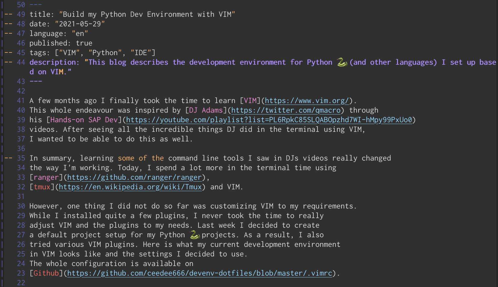
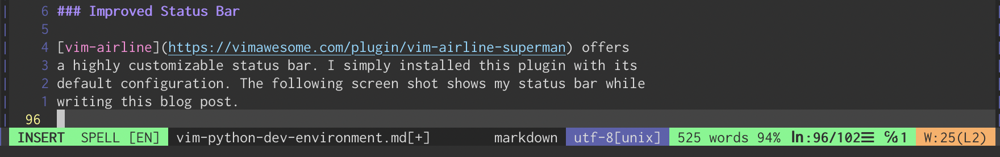
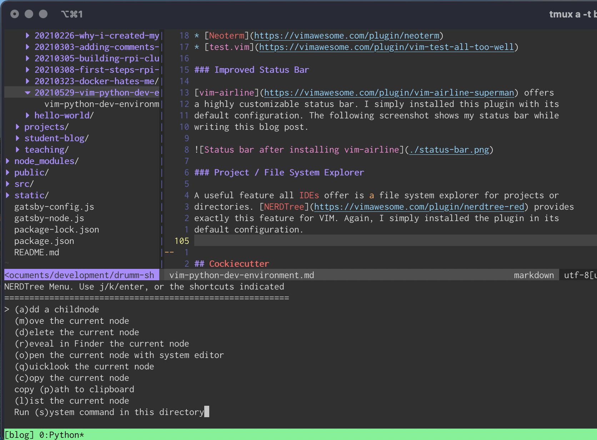
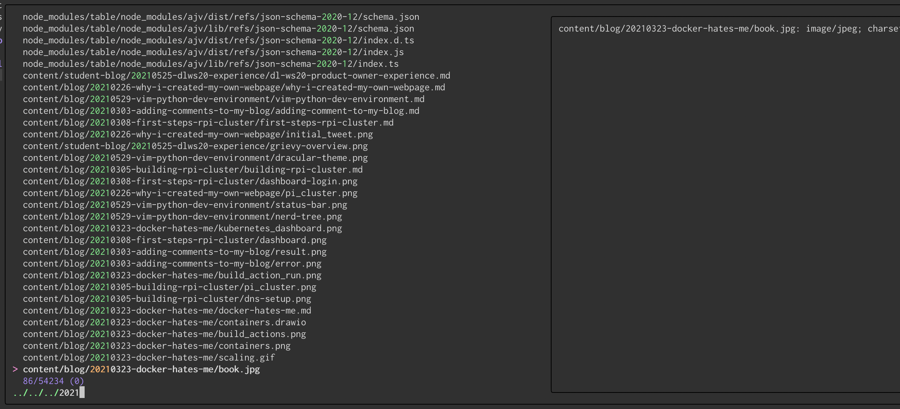

A few months ago I finally took the time to learn [VIM](https://www.vim.org/).
This whole endeavour was inspired by [DJ Adams](https://twitter.com/qmacro) through
his [Hands-on SAP Dev](https://youtube.com/playlist?list=PL6RpkC85SLQABOpzhd7WI-hMpy99PxUo0)
videos. After seeing all the incredible things DJ did in the terminal using VIM,
I wanted to be able to do this as well.

In summary, learning some of the command line tools I saw in DJs videos really changed
the way I'm working. Today, I spend a lot more in the terminal time using
[ranger](https://github.com/ranger/ranger),
[tmux](https://en.wikipedia.org/wiki/Tmux) and VIM.

However, one thing I did not do so far was customizing VIM to my requirements.
While I installed quite a few plugins, I never took the time to really
adjust VIM and the plugins to my needs. Last week I decided to create
a default project setup for my Python 🐍 projects. As a result, I also
tried various VIM plugins. Here is what my current development environment
in VIM looks like and the settings I decided to use.
The whole configuration is available on
[Github](https://github.com/ceedee666/devenv-dotfiles/blob/master/.vimrc).

## Basic OS Settings

One of the first things I did when learning VIM was to remap the `<caps lock>`
key. I highly recommend doing this as:

* `<caps lock>` is really not useful unless you are developing
[ABAP](https://en.wikipedia.org/wiki/ABAP)
* you will need to use the `<esc>` key a lot in VIM
* VIM offers out of the box functionality for
[switching cases of characters](https://vim.fandom.com/wiki/Switching_case_of_characters)
using `<g><U>` and `<g><u>`

## Basic VIM Settings

The most important setting for me is to activate the syntax highlighting and
automatic indentation. This
is done by adding this code to the `.vimrc`:

```
syntax on
set autoindent
```

> **Note:** The simplest approach to editing the `.vimrc` file is by executing
> `:e $MYVIMRC`

Next, of course, is a proper color there. After trying different ones, I finally
settled for the [Dracular Theme](https://draculatheme.com/vim). As I'm using the
[vim-plug](https://github.com/junegunn/vim-plug) as the plugin manager, I installed
the theme using:

```
Plug 'dracula/vim', { 'as': 'dracula' }
```

The color scheme is activated by adding `colorscheme dracula` to the `.vimrc`.
The following screenshot shows the dracula theme in action while editing
this blog post.



Next, I enabled relative line numbers by adding
`set number relativenumber` to the `.vimrc`. This way it is easy to see how many
lines I need to move up or down to put the cursor on a certain line.
Additionally, highlighting the current line with `set cursorline` helps me to
quickly spot the current line.

Finally, I added keyboard shortcuts to simplify moving between panes by
pressing `<ctrl>` and `<h>`, `<j>`, `<k>` and `<l>`.

```
map <C-j> <C-W>j
map <C-k> <C-W>k
map <C-h> <C-W>h
map <C-l> <C-W>l
```

## VIM Plug Ins

With the basic configuration in place, the next step is adding plugins to
extend the functionality of VIM. As mentioned above, I use
[vim-plug](https://github.com/junegunn/vim-plug) as my plugin manager.
In my current configuration I use the following plugins:

* [vim-airline](https://vimawesome.com/plugin/vim-airline-superman)
* [NERDTree](https://vimawesome.com/plugin/nerdtree-red)
* [fzf](https://vimawesome.com/plugin/fzf)
* [Conquer of Completion (CoC)](https://vimawesome.com/plugin/coc-nvim)
* [Asynchronous Linting Engine (ALE)](https://vimawesome.com/plugin/ale)
* [Neoterm](https://vimawesome.com/plugin/neoterm)
* [test.vim](https://vimawesome.com/plugin/vim-test-all-too-well)

### Improved Status Bar

[vim-airline](https://vimawesome.com/plugin/vim-airline-superman) offers
a highly customizable status bar. I simply installed this plugin with its
default configuration. The following screenshot shows my status bar while
writing this blog post.



### Project / File System Explorer

A useful feature all IDEs offer is a file system explorer for projects or
directories. [NERDTree](https://vimawesome.com/plugin/nerdtree-red) provides
exactly this feature for VIM. Again, I simply installed the plugin in its
default configuration. In contrast to IDEs there is no concept of a project
in NERDTree. Instead NERDTree simply show the directory from which VIM was
launched. As all of my projects are organized in different directories anyway,
this is all I need.

One of the nice feature of NERDTree is the action menu, which can be accessed
by hitting `<m>` inside the NERDTree window. This action menu provides
quick access to functions like creating, renaming, moving and deleting
files. The following screenshot shows the NERDTree and the actions menu
in the directory for this blog.



To enable me to quickly access NERDTree inside VIM I added the following
mapping to my `.vimrc`. This mapping allows me to toggle the NERDTree by
hitting `<ctrl>-<n>`.

```
map <C-n> :NERDTreeToggle<CR>
```

### FZF - the Command-line Fuzzy Finder

Having a project tree is nice. However, searching files in large project
or somewhere on the file system is quiet tedious this way. This is when
[fzf](https://github.com/junegunn/fzf) becomes very useful. Using fzf inside
VIM requires the installation of [two plugins](https://vimawesome.com/plugin/fzf-vim).

Again, I simply used the default configuration for this plugin. With
the plugins installed there are a few new commands available in VIM.
`:FZF` starts fzf in the directory of the current file. `:Files`
in contrast allows to specify a directory from
which fzf starts to search. The following screenshot shows the fzf pop up window
after executing `:Files` in the root directory of my website project and
entering a few search characters.



### Autocompletion

Of course, every development environment needs proper auto-completion.
For VIM, there a lots of different plugins offering this kind of functionality.
I decided to use [Conquer of Completion (CoC)](https://vimawesome.com/plugin/coc-nvim).
CoC support the [Language Server Protocol](https://microsoft.github.io/language-server-protocol/specifications/specification-3-15/)
which is the protocol [VS Code](https://code.visualstudio.com/) uses as well. Because of this,
CoC offers a similar feature set to the auto-completion in VS Code.

I added the following configuration to my `.vimrc`. I copied this configuration from
the CoC documentation. Lines 2 - 12 enable `<tab>` to complete suggestions.  Line 15
allows to trigger the suggestion popup using `<ctrl>-<space>`.
Lines 23 - 31 allow displaying documentation for the word under the cursor using
`<K>`. Finally, lines 35 - 42 add keyboard shortcuts to enable the navigation to
definitions, implementations and references.

```
" Use tab for trigger completion with characters ahead and navigate. // L1
inoremap <silent><expr> <TAB>
      \ pumvisible() ? "\<C-n>" :
      \ <SID>check_back_space() ? "\<TAB>" :
      \ coc#refresh()
inoremap <expr><S-TAB> pumvisible() ? "\<C-p>" : "\<C-h>"

function! s:check_back_space() abort
  let col = col('.') - 1
  return !col || getline('.')[col - 1]  =~# '\s'
endfunction

" Use <c-space> to trigger completion.
inoremap <silent><expr> <c-space> coc#refresh()

" Use <cr> to confirm completion, `<C-g>u` means break
" undo chain at current position.
" Coc only does snippet and additional edit on confirm.
inoremap <expr> <cr> pumvisible() ? "\<C-y>" : "\<C-g>u\<CR>"

" Use K to show documentation in preview window
nnoremap <silent> K :call <SID>show_documentation()<CR>

function! s:show_documentation()
  if (index(['vim','help'], &filetype) >= 0)
    execute 'h '.expand('<cword>')
  else
    call CocAction('doHover')
  endif
endfunction

" GoTo code navigation.
nmap <silent> gd <Plug>(coc-definition)
nmap <silent> gy <Plug>(coc-type-definition)
nmap <silent> gi <Plug>(coc-implementation)
nmap <silent> gr <Plug>(coc-references)

" Remap keys for applying codeAction to the current buffer.
nmap <leader>ac  <Plug>(coc-codeaction)
" Apply AutoFix to problem on the current line.
nmap <leader>qf  <Plug>(coc-fix-current)
```

The following GIF shows the plugin in action in a small python project.


> **Note:** CoC uses its own plugin manager. This means that CoC plugins
> are not installed using the VIM plugin manager. Instead the command
> :CocInstall is used to install the plugins. In my environment I
> currently have the following CoC plugins installed:
> * coc-markdownlint
> * coc-json
> * coc-html
> * coc-tsserver
> * coc-pyright
> * coc-css

### Linting and Fixing

With code completion in place I wanted to integrate linting and automatic
fixing of linting errors as well. For this purpose I installed the
[Asynchronous Linting Engine (ALE)](https://vimawesome.com/plugin/ale).
ALE basically works out of the box. However, ALE also supports the Language
Server Protocol a providing code completion. In my setup I wanted to use CoC
for code completion and ALE for linting. Therefor, I followed the suggestion
from the [ALE FAQs](https://github.com/dense-analysis/ale#faq-coc-nvim) and
added the following line to the CoCConfig:

```js
{
  "diagnostic.displayByAle": true
}
```

In addition, I disabled the usage of the Language Server Protocol for ALE by
putting the following line at the very beginning of my `.vimrc`:

```
let g:ale_disable_lsp = 1
```

Finally, I configured which fixers ALE should use based on different file types.
For all files I want to remove trailing lines and trailing white space. Javascript
should be fixed using [eslint](https://eslint.org/). Python 🐍 files are fixed using
[isort](https://pypi.org/project/isort/) and [black](https://pypi.org/project/black/).
Maybe I should also add [flake8](https://pypi.org/project/flake8/) to this list 🤔.

Setting `g:ale_fix_on_save` to `1` enables the automatic execution of the fixers
when a file is saved.

```
let g:ale_fixers = {
      \   '*': ['remove_trailing_lines', 'trim_whitespace'],
      \   'javascript': ['eslint'],
      \   'python': ['isort', 'black']
      \}

" Set this variable to 1 to fix files when you save them.
let g:ale_fix_on_save = 1
```

### Terminal

Although I mostly run VIM inside tmux I also installed
[Neoterm](https://vimawesome.com/plugin/neoterm). Neoterm
provides a nice integration of a terminal as well as the
REPLs of different programming languages.

I added the following
configuration to my `.vimrc`. The first line specifies
that the terminal should be opened in a new window below
the current one (cf. [documentation](https://github.com/kassio/neoterm/blob/cae4f19aeac40037039e914932da850443b7729f/doc/neoterm.txt#L245)).
The key mappings allow to toggle the terminal in all
modes using `<ctrl>-<y>`.

```
let g:neoterm_default_mod = 'botright'
nnoremap <c-y> :Ttoggle<CR>
inoremap <c-y> <Esc>:Ttoggle<CR>
tnoremap <c-y> <c-\><c-n>:Ttoggle<CR>
```

### Unit Testing

The plugin that completes my VIM setup is
[Test.VIM](https://vimawesome.com/plugin/vim-test-all-too-well). This
plugin allows to run unit test in different languages and using
different unit test frameworks. For Test.VIM I added the following
configuration to my `.vimrc`.

The first line specifies that I want to use pytest as the
test runner for python projects. Line 4 configures
Test.VIM to run all commands using Neoterm. Lines 7 - 11
define keyboard shortcuts to execute different
commands like running a test file (`<t>, <ctrl>-<n>`) or
running a whole test suite (`<t>, <ctrl>-<s>`).
Finally, lines 13 - 19 defines an auto-command to execute
all unit tests in a file whenever the buffer is saved.


```
let test#python#runner = 'pytest' // L1

" make test commands execute using neoterm
let test#strategy = "neoterm"

"keyboard short cuts
nmap <silent> t<C-n> :TestNearest<CR>
nmap <silent> t<C-f> :TestFile<CR>
nmap <silent> t<C-s> :TestSuite<CR>
nmap <silent> t<C-l> :TestLast<CR>
nmap <silent> t<C-g> :TestVisit<CR>

" auto commoand to run tests automatically
augroup test
  autocmd!
  autocmd BufWrite * if test#exists() |
        \   TestFile |
        \ endif
augroup END
```

## Summary

With the configuration and plugins describes in this
post I have now a really nice development environment
based on VIM. I hope this post helps others to configure
VIM to their needs without the need for all the trial and
error I went through.


## Useful Resources

* [vimawesome](https://vimawesome.com/): collection of awesome VIM plugins.
* YT [Playlist](https://youtube.com/playlist?list=PLu-ydI-PCl0OEG0ZEqLRRuCrMJGAAI0tW) on using VIM as an IDE
* [VIM for Python](https://www.vimfromscratch.com/articles/vim-for-python/)
* My [.vimrc](https://github.com/ceedee666/devenv-dotfiles/blob/master/.vimrc) file
