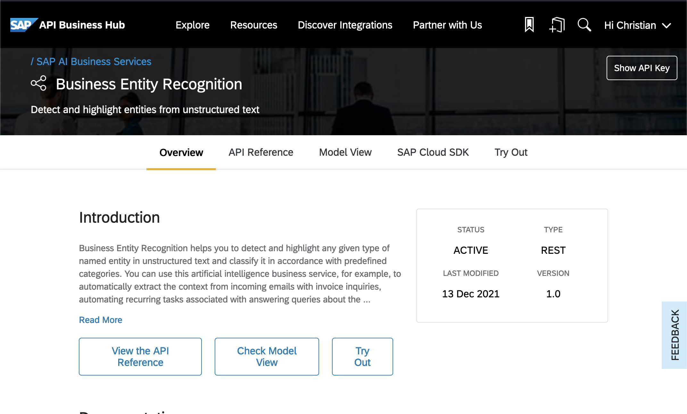
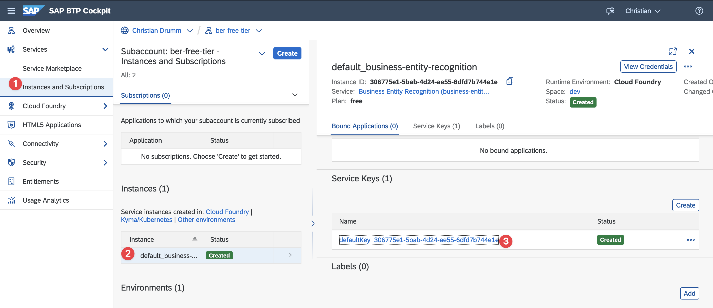

Between April and June 2022 my colleague Stephan and I taught a [Python](https://www.python.org/) [MOOC](https://en.wikipedia.org/wiki/Massive_open_online_course)
on the [openSAP](https://open.sap.com) platform. The course was named [Python for Beginners](https://open.sap.com/courses/python1).
It was very popular with over 40.000 participants and very well received. Many participants asked the following questions in the forum:

- Why is [SAP](https://www.sap.com) teaching [Python](https://www.python.org/)
- How can [Python](https://www.python.org) be used in the SAP ecosystem
- What is a possible next step for course participants

In this blog post I try to answer the second and third question in the list.
I will show one possibility of using Python in the SAP ecosystems. In particular, I choose a topic which does not require any
prior expertise in the SAP ecosystem.

## SAP and Python

Today, a search for [Tutorial related to Python](https://developers.sap.com/tutorial-navigator.html?search=Python) in the tutorial section of the
[SAP Developer Center](https://developers.sap.com/) returns 18 tutorials from a variety of areas. There
is even a [tutorial](https://developers.sap.com/tutorials/hana-cloud-python-analysis-multimodel-1.html)
showing how to set up a connection between SAP [HANA](https://www.sap.com/products/technology-platform/hana/what-is-sap-hana.html)
and a [Juypter Notebook](http://jupyter.org/). From the different available option I choose the
[SAP AI Business Services](https://help.sap.com/docs/SAP_AI_BUS) as the basis for this blog post. The reason being the these services
are easy to consume and do not require any expertise with other SAP products like SAP ERP or [SAP S/4HANA](https://help.sap.com/docs/SAP_S4HANA_ON-PREMISE).

## SAP AI Business Service

The [SAP AI Business Services](https://help.sap.com/docs/SAP_AI_BUS) are a collection of six services:

- Business Entity Recognition
- Data Attribute Recommendation
- Document Classification
- Document Information Extraction
- Personalized Recommendations
- Service Ticket Intelligence.

The remainder of this blog post will use the [Business Entity Recognition](https://help.sap.com/docs/Business_Entity_Recognition) service as an example.
Using the content form this blog post it should easily be possible to use the other services as well.

So what exactly is Business Entity Recognition?
The [documentation](https://help.sap.com/docs/Business_Entity_Recognition/b43f8f61368d455793a241d2b10baeb2/894afc838ee54c0f8c7f7381a9dae27a.html)
states that Business Entity Recognition is used to:

> Detect and highlight entities in unstructured text using machine learning.

Given the following plain text as input:

```
Christian Drumm works at the FH Aachen.
The FH Aachen is located at the Eupener Str. 70 in Aachen, Germany"
```

The Business Entity Recognition service could, for example, identify the following concepts:

- **Address**: Eupener Str. 70, Aachen, Germany
- **Person**: Christian Drumm
- **Organization**: FH Aachen

Exactly which concepts can be identified depend on the variant of the Business Entity Recognition service used. A discussion of the differences
and possibilities is beyond the scope of this post and can be found in the documentation.

For testing the Business Entity Recognition service two possibilities exist. Either a public sandbox can be used or a free trail of the service.
I would recommend using the free trial. While it requires some initial set up (which is nicely described in this
[tutorial](https://developers.sap.com/tutorials/cp-aibus-ber-service-instance.html)) it has a much better performance then the sandbox system.
Depending on when you try to use the service the sandbox sometimes requires waiting several minutes for results.

## SAP API Business Hub

The first step to testing the Business Entity Recognition service is to understand the [API](https://en.wikipedia.org/wiki/API) of
the service. All APIs offered by different SAP products are listed on the [SAP API Business Hub](https://api.sap.com/).
The SAP API Business Hub provides two main features:

- discovering available APIs
- documentation and test functionality for the APIs.

Important notice: In order to follow use the test functionality it is necessary to register and login to the SAP API Business
Hub. Otherwise some of the functionality is not available.

### API of Business Entity Recognition Service

The image below shows the overview page of the [API of the Business Entity Recognition Service](https://api.sap.com/api/business_entity_recognition_api/overview)
on the API Business Hub.



A detailed specification of the API is available on the API Reference page. The Try Out page enables
the testing of the service directly in the SAP API Business Hub.

The API Reference page show which operations are offered by the Business Entity Recognition service. The service
offers operations related to:

- Datasets
- Training
- Models
- Deployments
- Inference.

The operations related to datasets, training, models and deployments are relevant when training own models. For
testing the service these operations are not necessary. Only the operation related to inference are used in the following.

### Testing the API

In order to understand the Business Entity Recognition
service I will not describe how to test the service in the SAP API Business Hub. Instead I will explain how
to test the API using [HTTPie](https://httpie.io/) (other options to test the API are tools like [Postman](https://www.postman.com/)
or the [Rest Client](https://marketplace.visualstudio.com/items?itemName=humao.rest-client) for Visual Studio Code).

Although HTTPie provides a Web-based tool and a native app I will be using the [CLI](https://en.wikipedia.org/wiki/Command-line_interface)
client in the following. The reason for this is that [#TheFutureIsTerminal](https://blogs.sap.com/tag/thefutureisterminal/) 😉.

## Testing the Inference of the Business Entity Recognition Service

In order to test the inference of the Business Entity Recognition service the following steps are necessary:

1. Getting an OAuth access token for the service
1. Posting the inference data
1. Getting the result of the inference.

Each of this steps is described in detail in the following sections.

### Get an OAuth Access Token

Describing the details of OAuth is beyond the scope of this blog post. This [video](https://community.sap.com/media/devtoberfest/cloud-apis-ex-2-oauth-2)
provides a nice introduction to the topic.

The [documentation](https://help.sap.com/docs/Business_Entity_Recognition/b43f8f61368d455793a241d2b10baeb2/c4517867c219438ab35d8d3daa93edd9.html)
describes the steps necessary to get an OAuth bearer token. In order to get a token an HTTP GET request needs to be send
to the path `/outh/token`. In order to get the bearer token the parameter `grant_type` needs to be set to `client_credentials`.

The important question is now where to send the GET request. In the SAP BTP this information is contained in the
service key of the respective service. To find the service key navigate to _Instances and Subscriptions_. Select your instance there
and open the details of the service key.



The service key is in JSON format ans should look similar to this

```json
{
    "url": "https://business-entity-recognition.cfapps.eu10.hana.ondemand.com",
    "swagger": "/api/v1",
    "uaa": {
        "clientid": <your-client-id>,
        "clientsecret": <your-client-secret>,
        "url": "https://<your-instance-id>.authentication.eu10.hana.ondemand.com",
        ...
    }
}
```

Using the URL given in the `uaa` part of the service key a bearer token can be requested. Using HTTPie the GET request
looks like this:

```bash
http -a <your-client-id>:<your-client-secret> \
"https://<your-instance-id>.authentication.eu10.hana.ondemand.com/oauth/token?grant_type=client_credentials"
```

In order to save some typing I usually store the client id and client secret in en environment variable. But this is not required.
Furthermore, it might be necessary to surround the values with single quotes `'`. If everything works the response should look something
like this:

```bash
HTTP/1.1 200 OK
....
{
    "access_token": "eyJhbGciOiJS...",
    "expires_in": 43199,
    "jti": "27294b49bf47456380850bcf68ccaa04",
    "scope": "uaa.resource ner-production!b30772.default",
    "token_type": "bearer"
}
```

The important part of the response is the access token. This very long token is used to invoke the different operations
of the Entity Recognition service.

# Posting the Inference Data

Recognising entities using the Business Entity Recognition service is a two step process. First the
data is uploaded to the service. The service performs the recognition of the entities asynchronously.
After the recognition is complete, the result can be retrieved. Therefore, the next step is now
to upload the inference data. For this blog post I will use the following text as inference data:

```
Christian Drumm works at Eupener Str. 70 in 52072 Aachen, Germany.
```

To upload this data to the Business Entity Recognition service a `POST` request to the path
`/inference/jobs` needs to be executed. The URL for the service can again be found in the service key.
The URL consists of the two parts `url` and `swagger`. Authentication for the service is performed using
the access token retrieved in the previous step.

The actual data is uploaded as an JSON object. HTTPie
automatically build a JSON object form the provided parameters.

In addition it is required to define which inference model should be used.
In this example the [sap_address_entity](https://help.sap.com/docs/Business_Entity_Recognition/b43f8f61368d455793a241d2b10baeb2/55ab2ca0f9064aefbc1425246a1b3d1f.html?locale=en-US&q=sap_address_entity)
is used.

So in summary the data can be uploaded using the following
command.

```bash
http -A bearer -a <your-bearer-token> POST \
https://business-entity-recognition.cfapps.eu10.hana.ondemand.com/api/v1/inference/jobs \
text="Christian Drumm works at Eupener Str. 70 in 52072 Aachen, Germany." \
modelName="sap_address_entity"
```

If everything works the service returns a response like the one below:

```json
{
  "data": {
    "freePlanUsage": {
      "inferenceCharactersUsage": "Maximum limit of 120000 , utilized 471 Inference characters and remaining 119529",
      "inferenceRequestsUsage": "Maximum limit of 30 , utilized 3 Inference count and remaining 27"
    },
    "id": "e74fbde9-11e7-4e04-94db-dbf56768ec4e",
    "message": "Inference job has been submitted",
    "modelName": "sap_address_entity",
    "modelVersion": null,
    "status": "PENDING"
  }
}
```

The response show that the inference job has been submitted. The ID of the job is returned in the `id`.

## Getting the results

In order to get the result of the inference service a GET request is executed to the path `/inference/jobs/<job-id>`.
The job id in this path is the job id from the previous service. So in order to get the result the following
HTTPie command can be used.

```bash
http -A bearer -a <your-bearer-token> \
https://business-entity-recognition.cfapps.eu10.hana.ondemand.com/api/v1/inference/jobs/<job-id>
```

Below is the result of this request.

```json {numberLines}
{
  "data": {
    "createdAt": "2022-10-14T10:26:45Z",
    "freePlanUsage": {
      "inferenceCharactersUsage": "Maximum limit of 120000 , utilized 603 Inference characters and remaining 119397",
      "inferenceRequestsUsage": "Maximum limit of 30 , utilized 5 Inference count and remaining 25"
    },
    "id": "684ad559-b42f-462a-b865-65958e1c2865",
    "modifiedAt": "2022-10-14T10:26:58Z",
    "result": [
      {
        "cityTownVillage": [
          {
            "confidence": 1.0,
            "value": "Aachen"
          }
        ],
        "country": [
          {
            "confidence": 0.9,
            "value": "Germany"
          }
        ],
        "customerName": [
          {
            "confidence": 0.92,
            "value": "Christian Drumm works"
          }
        ],
        "district": [],
        "houseNumber": [
          {
            "confidence": 0.99,
            "value": "70"
          }
        ],
        "stateProvince": [],
        "street": [
          {
            "confidence": 1.0,
            "value": "at Eupener Str"
          }
        ],
        "zip": [
          {
            "confidence": 1.0,
            "value": "52072"
          }
        ]
      }
    ],
    "status": "SUCCESS"
  }
}
```

The `status` in line 52 show that the inference job completed successfully. In addition each identified entity is
returned together with confidence value. For example, line 31 ff shows that the concept
house number has been identified with a confidence of 0.99 and the value of the house number is 70.
Line 44ff shows that the concept zip has been identified with a confidence of 1.0 and the
value is 52072.

## Using the Service in Python

After using HTTPie to invoke the service the next step is to build a simple Python program to do the same.
The following listing contains a simple Python program executing the previous steps.

```Python {numberLines}
import requests
import time
import json

# Constants
CLIENTID = "<your-client-id>"
CLIENTSECRET = "<your-client-secret"

AUTH_SERVICE = "https://<your-instance>.authentication.eu10.hana.ondemand.com/oauth/token?grant_type=client_credentials"
BER_SERVICE = "https://business-entity-recognition.cfapps.eu10.hana.ondemand.com/api/v1/inference/jobs"

#Get input from the use
user_input = input("Please enter a text: ")

# Step 1: get the bearer token
authentication = requests.get(AUTH_SERVICE, auth = (CLIENTID, CLIENTSECRET))

# Check if we got an authentication token
if authentication.status_code == 200:

    #Step 2: Submit the inference job
    payload = {"text": user_input, "modelName": "sap_address_entity"}
    headers = {"Authorization": "Bearer " + authentication.json()["access_token"]}

    submitted_job = requests.post(BER_SERVICE, json=payload, headers=headers)

    #Step 3: Wait until the job is finished
    job_finished = False
    while not job_finished:
        job_result = requests.get(BER_SERVICE + "/" + submitted_job.json()["data"]["id"], headers=headers)
        if job_result.json()["data"]["status"] == "SUCCESS":
            job_finished = True
            print("Job finished")
        else:
            print(".", end="", flush=True)
            time.sleep(2)

    # Print the job results
    format_jason = json.dumps(job_result.json(), indent=2)
    print(format_jason)
```

To call the service in Python the [requests](https://pypi.org/project/requests/) library is used. This library
is imported in line 1. Lines 6 - 10 defines a few constants. The values `<your-client-id>`, `<your-client-secret>` and
`<your-instance>` need to be replaced with the values for your service. Line 13 get the text from the user
to be analysed.

The first step (line 16) is to get the bearer token using the service URL. The
authentication for this service is performed using the client id and client secret.
If the request was successful (line 19) the POST request is created in lines 22 - 25.

The `while` loop in lines 28 - 36 checks the job result (line 30) until the status is `"SUCCESS"`.
If the job ended successfully the result is formatted using the `json` library (line 39) and printed.

## Summary

I hope this blog post showed how easy it is to consume SAP service in Python. While I used the Business Entity Recognition service,
using other services works using the same approach. So now you are able to apply the Python knowledge from
the [Python for Beginners](https://open.sap.com/courses/python1) course in the SAP ecosystem.

If you have any question please feel free to ask them in the comments.

Christian
