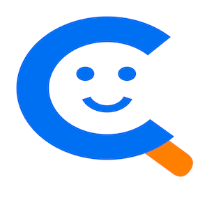

# celoq - Your privacy-first wellbeing companion

## Description

celoq is a privacy-first wellbeing tracker built for people managing chronic
conditions like celiac disease, migraines, and other health issues. Record how
you feel each day on a simple 1 to 5 scale, and over time you will have a
powerful picture of your overall wellbeing. Use the calendar, list, and graph
views to explore your data — see month-by-month trends, browse detailed
entries, or zoom into specific periods to spot patterns you might otherwise
miss. All your data stays on your device. No accounts, no servers, no tracking.

celoq helps you identify triggers by letting you track the events that matter
to you. Log gluten accidents, migraines, or create your own custom events with
color-coded badges that make patterns easy to spot. Scan product barcodes with
your camera to instantly log what you eat, or type in product and location
names manually — quick-entry pills remember your recent choices for one-tap
logging. Add optional text notes to any entry for extra context, whether it is
what you ate, how you felt, or anything else worth remembering.

Share your data across devices using iCloud Drive, Nextcloud, or any file
provider that works with your device. Export your log as a PDF to share with
your doctor or keep as a personal record. Choose light, dark, or system theme
for comfortable viewing in any lighting. celoq is available in English and
German, with a community-friendly setup for adding more languages. Your data is
yours — celoq is built with privacy as a core principle.

## Privacy policy 🕵️‍♀️

celoq respects your privacy. This policy explains how the app handles your
data.

### Data Storage

All data you enter into celoq — including your daily wellbeing scores, notes,
products, locations, and event entries — is stored exclusively on your device.
No data is transmitted to any server, cloud service, or third party.

### No Tracking

celoq does not collect analytics, usage statistics, or any form of tracking.
There are no tracking libraries, no ad networks, and no telemetry.

### No Accounts

celoq does not require you to create an account or provide any personal
information such as your name, email address, or phone number. No Third-Party
Data Sharing

Because no data leaves your device, there is no sharing of data with third
parties.

### Data Sync

If you choose to enable multi-device sync (e.g., via iCloud Drive or
Nextcloud), data is transferred through your chosen provider under their own
privacy policy. celoq does not control or access this transfer.

### Barcode Scanning

When you scan a product barcode, the barcode number is looked up against [Open
Food Facts](https://world.openfoodfacts.org/) to retrieve the product name.
This lookup sends only the barcode number — no personal data is transmitted.

## Support

For any questions regarding this app write an email to celoq at trans4m.io.

## Source Code

The complete source code of the app is available on [Codeberg](https://codeberg.org/ceedee666/celoq).
