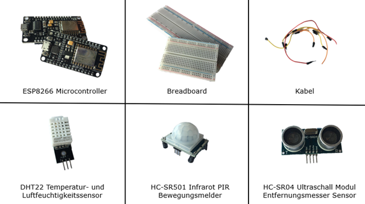
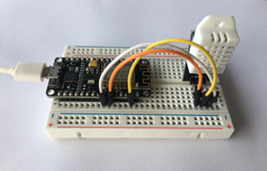
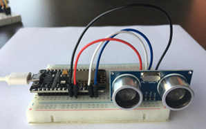
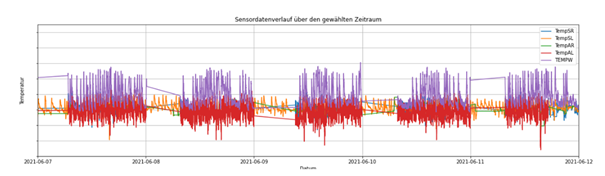

## Networking on multiple levels

Ever spent a week at 3°C with microcontrollers and sensors? We have. We are
[Corinna Aufderheide](https://www.linkedin.com/in/corinna-aufderheide-085613209/)
and Anne Mayer and in this blog post we would like to tell
you about our experiences in the lecture "Industrial Production and Industry 4.0"
and give you some insights into our last semester.

"Industrial Production and Industry 4.0" is a lecture in the second semester of
the 4-semester master's program [Industrial Engineering](https://www.fh-aachen.de/en/course-of-study/industrial-engineering/).
Beforehand, we were given the task to order some hardware components like a
[ESP8266 Microcontroller](https://www.amazon.de/dp/B06Y1LZLLY),
breadboards and a [sensorkit](https://www.amazon.de/dp/B01M30ZWQR/)
with seemingly endless possibilities. Due to the lack of prior experience with
microcontroller and sensor, we were
overwhelmed by the variety of the sensors to choose from. During an
introductory session [Prof. Drumm](https://drumm.sh) and
[Prof. Meinecke](https://www.fh-aachen.de/menschen/meinecke/) gave us various examples of what
can be done with the sensors. For example, we learned how to trigger an LED when
pressing a button or how to measure temperature and humidity in a room.

The following image shows a few of the components we used in our project.

At this point We were very glad that we took the Python introductory lecture
in the previous semester. This enabled us to quickly program the microcontroller
using PyCharm and to analyse data using Jupyter Notebooks. In addition, we were
also introduced to the [AWS IoT Services](https://aws.amazon.com/iot/). These are
cloud services
provided by Amazon to collect and process large amounts of data.

## Industry 4.0

But the question that interested everyone in the course: What do I do with
all this in real life?

Industry 4.0 - as the fourth industrial revolution is known - has become an
integral part of the industrial context. It is about digitalization and the
intelligent networking of machines and processes using internet technologies.
The possibilities and potentials that Industry 4.0 holds for
industrial production were the central topic of the lecture taught by
Prof. Drumm, Prof. Meinecke and Prof. Luft. In addition to the introductory session,
we were provided with 12 learning videos on different topics in the context
of Industry 4.0. The topics included cyber-physical systems, cloud computing,
Big Data, business analytics and the autonomization of production. The
underlying question always was: How can industrial production
be supported and improved using those technologies?

## A real-world use case

Building on this question, we were asked to find a use case for
an IoT project. The goal was to investigate a real-world problem by recording
data using sensors and microcontrollers, storing the data using AWS IoT service,
and then analyzing the data to generate some insights. If possible, the use case should
be in an industrial context. This was a big challenge for most of the students due to the
pandemic situation. We were lucky and were able to conduct our project together
with a company. Through research and several discussions, we came into contact
with a logistics service provider that specializes in the storage and
transport of frozen goods. For this company we implemented a project in which we examined
temperature changes in a cold storage hall for fresh products. For the project
microcontrollers were attached to all doors of the cold storage hall as well as to the ceiling.
The microcontrollers were connected to 5 motion sensors at the gates and 9 temperature sensors
distributed throughout the storage hall at heights of 2 and 8 meters.
The images below show the prototypical setup with a temperature sensor and a motion
sensor respectively.

Within a week, 2.5 million data points were collected using those 14
microcontrollers and sensors. All this data had to be analysed afterwards.

## Some difficult problems

We worked several hours per week on the project, and it was a strain on our nerves.
In contrast to the "laboratory conditions" at home, WLAN interruptions, daily
resets and inexplicable phenomena in the industrial context were more
difficult to analyse and solve on site. But we also learned first-hand what to
look out for when carrying out a project in an industrial setting. For example, we learned a
lot about data protection, the right choice of sensors and that working in a
cold storage hall at 3 °C can be really tough.

We also had to deal with the
problems that arose from the people working in the storage hall.
For example, we discovered that an
infrared sensor also reacted to the body temperatures of the employees behind
the gates and provided unusable data for the project. We therefore decided to use ultrasonic
sensors instead.

We also had to deal with WLAN dropouts at night. These can be seen in
the image below. For some unexplained reason WLAN connection of the microcontroller
stopped every night. A software solution was not successful here and the
application of a hardware reset was not feasible in the short project phase.
Therefore, the only option for us was a manual reset every microcontroller every morning
with the help of an employee of the logistics company in order to record suitable data.

During programming and analysis, further problems arose due to the high number
of data. All the data stored in AWS had to be cleaned and changed to the
same format. This resulted in high run times for the data analysis program. As
a result we had to learn about parallel processing in Python on our own
to be able to present a descriptive and fast solution.

## Our results

After the analysis, we presented our results to the logistics company and made
the analysis tool available to them. Based on our analysis the logistics company
will start to work on the detected problems and thereby improve the cold chain
for fresh products.

## Some thoughts on the lecture

The project was a real challenge through which we were able to learn what it means
to carry out a project in practice. Through our
perseverance, we were ultimately able to create value for our project partner.
In summary the lecture gave us the opportunity to gain valuable experience in
practice and to experience for ourselves how Industry 4.0 technologies can be
used and what their potential is. With the expansion of our network,
knowledge and experience, the high effort of the module was definitely worth it.
