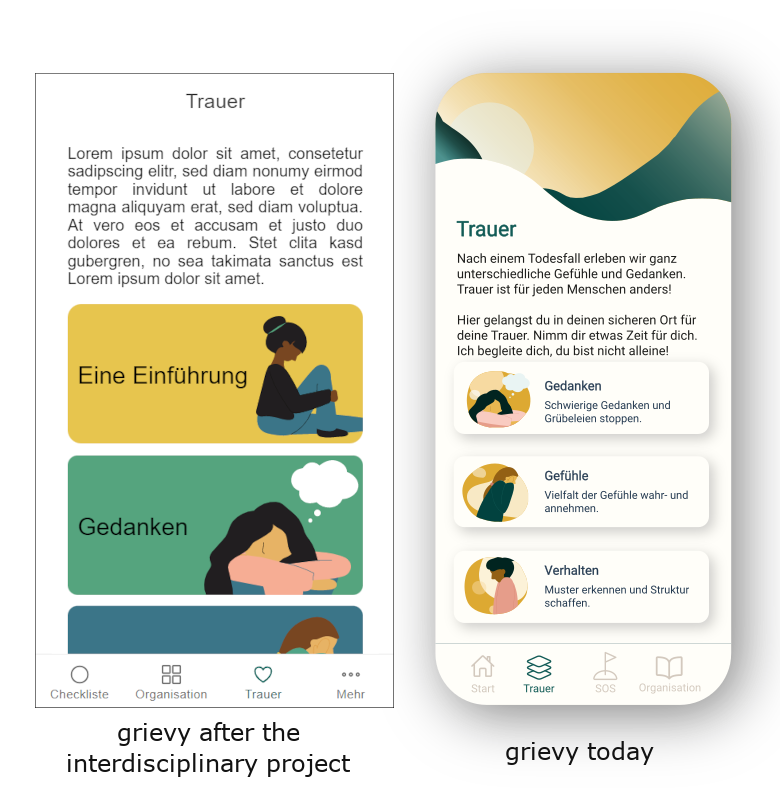

## The beginning of the project

As part of the interdisciplinary project, I had the opportunity to get to know
many different interesting projects. From the beginning, grievy particularly
caught my eye. On the one hand, I had a direct connection
to the idea of grievy, as a digital accompaniment after a death, since I had to
mourn a death in my family a few years ago. On the other hand, grievy was a
start-up with an innovative idea and a young, interesting team.
With a little luck of the draw (I was not the only one who found grievy very
interesting) I made it into the team of my wishes.

## The realization of the project

Together with 5 fellow students I was part of the developer team, while Nele
acted as product owner and Christian Drumm was the scrum master.
Since none of us knew anything about programming an app, it took a while until
we found our way into the project.
But with each sprint we became more productive, organized and efficient.
We also got to know each other better and improved our collaboration more and more.
At the end of the project, we had a very good product, which we were able to present to the other teams in a final presentation.

## What I learned

In addition to my programming skills, I was also able to improve collaboration
with other project participants. Furthermore, I was able to enhance my
self-organization and time management. Last but not least, the project taught us
the agile Scrum method, as we used it every week. For the changing requirements
within the project, this method was optimal.

## What happened next

I was very pleased with the way the project went. The result was excellent and I
also had a lot of fun during it.
A face-to-face final event, which unfortunately couldn't take place due to the
pandemic, would have been the cherry on the cake.

But the project should not be over for me yet. Nele, the product owner in the
project and founder of grievy, was so happy with the result of our
collaboration that she asked me and a colleague if we would like to continue
working on grievy in the long term.
I didn't have to think long, for me grievy is a great opportunity and I have
fun working on it. So our partnership continues.

## Where we stand today

Since the end of the interdisciplinary project, we have continued to work on
grievy. Aenis, my colleague and friend, and I are responsible for the
development of the app and all the technical aspects around it. Together with
Nele we have further developed the app itself and grievy in general.

In October we finished the first test version of our app. A closed group of
testers was able to put the app under the microscope.
Among the testers were funeral directors, grief counselors, software
developers and of course the original team from the interdisciplinary project.
The response was very positive and we received a lot of praise. But of course
there are still things we need to correct and optimize. We are very grateful
for the positive feedback and constructive criticism. At the moment we are
working on implementing the feedback and completing the app. We are very
excited to finally release the app next year.

As you can see, a lot has changed at grievy since the prototype from the
interdisciplinary project. The most work for me was programming and
continuously improving the app. But there was also a lot to do organizationally.
We applied for scholarships, successfully participated in competitions for
founders, planned the long-term development of grievy, and much more.

In addition to our work as software developers for grievy, Aenis and I,
together with Nele, will also be involved in the start-up as co-founders. To
put it in a nutshell, grievy and the interdisciplinary project are a great
opportunity for me and I look forward to the journey ahead.

## Contact us

### grievy

E-Mail: hallo@grievy.de  
Website: https://grievy.de/   
Instagram: https://www.instagram.com/grievy.app/

### Me

E-Mail: daniel.bachmann@grievy.de  
LinkedIn: https://www.linkedin.com/in/daniel-bachmann-2b7160211/

### Nele Stadtbäumer

E-Mail: nele.stadtbaeumer@grievy.de  
LinkedIn: https://www.linkedin.com/in/nelestadtbaeumer/  
