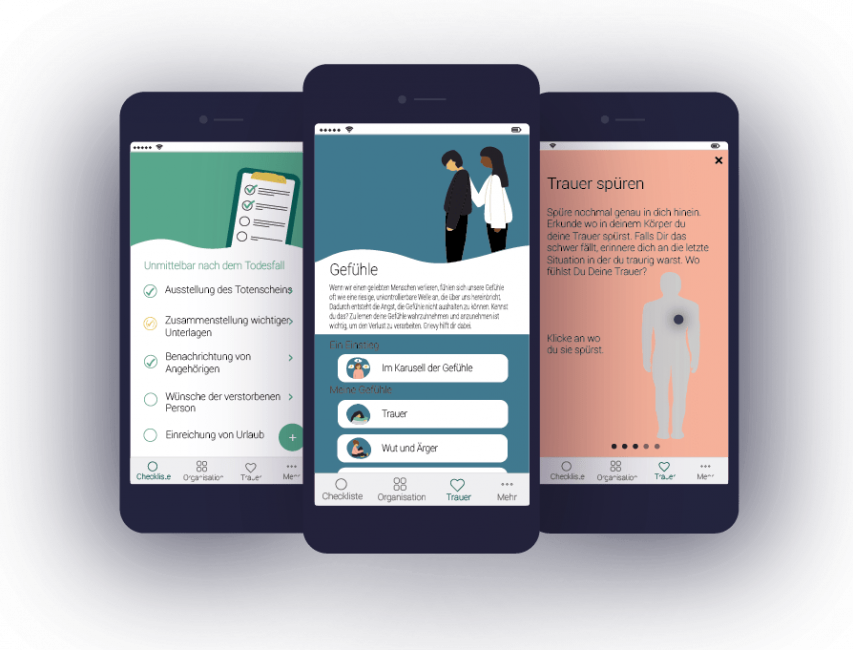

## The project

Through a death in my family, I have experienced what it means to lose a loved one.
Many relatives feel overwhelmed with organizational matters and left alone with their
grief. The scientific situation shows: the risk of mental illness is demonstrably
increased after an experienced bereavement. The handling of the many organizational
tasks, as well as the accompaniment through the grief have hardly arrived in the
digital space.

My idea is to develop an app that accompanies, supports and demonstrably relieves
people at exactly these points after the death of a loved one. My name
is [Nele Stadtbäumer](http://www.linkedin.com/in/nelestadtbaeumer), I am a psychologist and
founder of [grievy](http://www.grievy.de) - the first digital companion after a death.

## The beginning of the collaboration

For the implementation of the grievy app, I needed technically-savvy people who could bring the
content created by our psychotherapists and designers into the format of an app. My goal was to
give young people the chance to actively shape and collaborate on a practical project.
Through the recommendation of a friend, I turned to Prof. Christian Drumm. Fortunately, it
was just before the winter semester and the start of the project seminar. Luckily, I had
the chance to become a project partner with grievy.

## The collaboration

The collaboration started with a presentation of all projects and project partners for the students in
seminar. All projects were very interesting and in total very diverse, so that there should have been
something for every area of interest. My concern was that grievy is only an idea and a start-up in its
infancy, and therefore not very interesting for students. Especially in contrast to the big companies
involved. However, my concerns were completely unfounded. The project was very popular with the
students and the participants had to be chosen through a lottery. Finally, a great team of 6 students as
developers, Christian Drumm as Scrum Master and myself as Product Owner was founded.

We worked remote throughout the entire project (due to the pandemic). We organized all user stories
via a common Trello board and communicated via mail and Zoom. As the collaboration progressed, we
could see the students growing in their tasks and becoming more independent and organized. They really
outgrew themselves over the course of the project seminar and, with no prior knowledge of app
programming, created a first product version that was something to behold!

I enjoyed the collaboration very much and learned a lot myself. I felt informed at all times and was
surprised every week how much the students achieved within a week. They brought in their own ideas
and showed me different ways to implement each idea of mine. Our Scrum Master, Christian Drumm,
steered us safely through the project and kept an eye on the time frame and the tasks.

## Outlook

The final presentation in the plenum rounded off the project seminar. During the seminar we
focused on the organizational part of the grievy app. The final state after the project seminar
was an app with all organizational information and services, as well as placeholders for what is
still planned in the future. We would not have expected this great result in such a short time!

Even today, two of the students are still working on grievy. I always look back on that time with
pleasure and I am very happy that this collaboration came about. I am already thinking about how
we can be involved again in the next project seminar. I am already looking forward to the next
collaboration!
