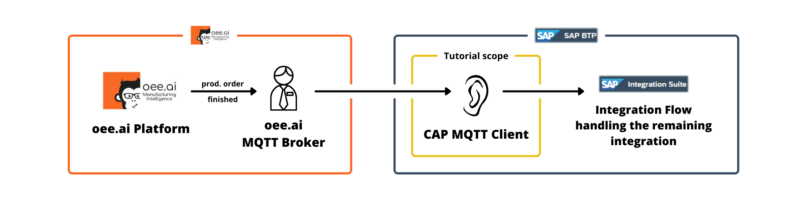

## Developing a CAP Application Integrating MQTT with Integration Suite

> This blog post is part of a series of posts describing an integration
> project which connects the [oee.ai Manufacturing Intelligence Platform](https://oee.ai/)
> with the production planning capabilities of an on-premise S/4HANA system.
> This project was realized by students at FH Aachen – University of Applied
> Sciences with great support by project partners at oee.ai and SAP. You can
> check out the main article describing the project [here]() (link pending).

In this tutorial video you will learn how to build an [SAP CAP](https://cap.cloud.sap/docs/)
application capable of receiving [MQTT](https://www.hivemq.com/mqtt/mqtt-protocol/)
messages and reacting to them and how to safely deploy it to a Cloud Foundry
space on BTP. To accomplish this goal, several SAP technologies such as the [
BTP CI/CD service](https://help.sap.com/products/BTP/65de2977205c403bbc107264b8eccf4b/fe74df55b0f54e99bf6e13a3b53e1db0.html?locale=en-US)
and the [Credential Store service on BTP](https://help.sap.com/viewer/601525c6e5604e4192451d5e7328fa3c/Cloud/en-US/02e8f7d1016740b8adf68690f36df142.html) are utilized.

### Background

During our integration — as described in the [main article]() (link pending)
of this series of blog posts — it was necessary to build such an application.
Our use case was that we needed to synchronize production orders marked as
finished in our oee.ai system with our S/4HANA system by creating according
production order confirmations. A production order is deemed finished as soon
as the desired number of produced units defined for the production order is reached.

To accomplish this behavior, our application first connects to the MQTT broker
of oee.ai. It then continuously receives messages indicating a finished
production order. Once such a message is received, an integration flow is
triggered handling the confirmation of the production order in S/4HANA. You
can read more about this process [here]() (link pending).

We needed to develop this part of the integration ourselves because there
currently is no standard way to listen and react to MQTT messages inside
[SAP Integration Suite](https://www.sap.com/products/integration-suite.html).
We were required to use Integration Suite though because the information about
a finished production order is processed further by an integration flow
created in Integration Suite.

### Tutorial video

<iframe width="900" height="600" src="https://www.youtube.com/embed/jDlkjcdNfUo" title="YouTube video player" frameborder="0" allow="accelerometer; autoplay; clipboard-write; encrypted-media; gyroscope; picture-in-picture" allowfullscreen></iframe>

#### Prerequisites

- Access to SAP BTP. A [trial account](https://developers.sap.com/tutorials/hcp-create-trial-account.html)
  with the necessary entitlements for the services used works as well.
  - [How to add entitlements to your subaccount](https://developers.sap.com/tutorials/cp-cf-entitlements-add.html)
- An SAP user account **not** using SAP Universal ID for authentication
  - Here’s why Universal ID won’t work: We use the BTP CI/CD service to deploy
    to a Cloud Foundry space. The CI/CD service however does that by
    programmatically accessing the Cloud Foundry space using the according CLI
    which requires authentication. But to authenticate via the CLI using SAP
    Universal ID, [a browser seems to be required](https://help.sap.com/products/BTP/65de2977205c403bbc107264b8eccf4b/7a37d66c2e7d401db4980db0cd74aa6b.html?locale=en-US)
    (scroll down to the last note) which is not practicable in the context of an automated CI/CD job.
  - This account can be different from the account used to set everything up
    in BTP. Just make sure to [assign the necessary role collections](https://help.sap.com/products/BTP/65de2977205c403bbc107264b8eccf4b/14a877c6e2f14832999df500ffa6e05e.html?locale=en-US)
    to the account to be able to access the Cloud Foundry space to deploy to.
- An empty Git repository to store the code base of the application, preferably
  hosted on GitHub or a GitLab instance. Make sure to have it [cloned](https://git-scm.com/book/en/v2/Git-Basics-Getting-a-Git-Repository) to your local system.
  - [Create a new repository on GitLab](https://docs.gitlab.com/ee/user/project/repository/#create-a-repository)
  - [Create a new repository on GitHub](https://docs.github.com/en/repositories/creating-and-managing-repositories/creating-a-new-repository)
  - [Git basics](https://www.atlassian.com/git)
- [Node.js](https://nodejs.org/en/download/) installed, preferably the latest LTS version
- Any editor or IDE supporting Node.js
  - e.g. [Visual Studio Code](https://code.visualstudio.com/), the editor used throughout the tutorial video

#### Resources

- [GitLab repository](https://gitlab.com/thunze/cap-mqtt) as shown in the video
- [SAP Cloud Application Programming Model](https://cap.cloud.sap/docs/)
- [SAP CDS Language Support Extension](https://marketplace.visualstudio.com/items?itemName=SAPSE.vscode-cds) (VS Code only)
- [HiveMQ Public MQTT Broker](https://www.hivemq.com/public-mqtt-broker/)
- [mqtt](https://www.npmjs.com/package/mqtt) (dependency)
- [axios](https://axios-http.com/) (dependency)
- [OAuth 2.0 Introduction](https://cloud.google.com/apigee/docs/api-platform/security/oauth/oauth-introduction), [axios-oauth-client](https://www.npmjs.com/package/axios-oauth-client) (dependency)
- [MTA Development Descriptor Reference](https://help.sap.com/viewer/4505d0bdaf4948449b7f7379d24d0f0d/2.0.01/en-US/4486ada1af824aadaf56baebc93d0256.html) (mta.yaml)
- [.gitignore file](https://www.atlassian.com/git/tutorials/saving-changes/gitignore)

#### Additional notes

- To find the endpoint URL provided for your integration flow, open your
  Integration Suite instance. Select **Monitor → Overview → Manage Integration
  Content** and then the integration flow in question.
- **node-fetch** and **node-jose** are required for the boilerplate code used
  to access the Credential Store.
  - **Disclaimer:** I did not write the specific code present in `credStore.js`
    using these dependencies myself and instead relied on the [CAP Generator](https://github.com/saphanaacademy/generator-saphanaacademy-cap/blob/main/generators/app/credStore.js)
    available in [SAP Business Application Studio](https://help.sap.com/products/SAP%20Business%20Application%20Studio/9d1db9835307451daa8c930fbd9ab264/8f46c6e6f86641cc900871c903761fd4.html?locale=en-US).
- **node-fetch** version 3 [is not supported](https://github.com/node-fetch/node-fetch#:~:text=from%20%27node%2Dfetch%27%3B-,CommonJS,-node%2Dfetch%20from) because CAP doesn’t seem to support ES modules yet.
