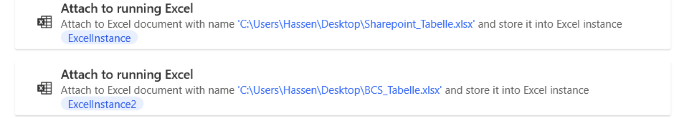
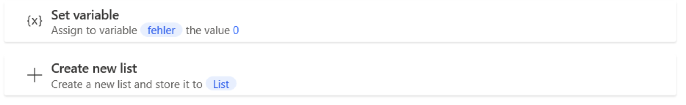
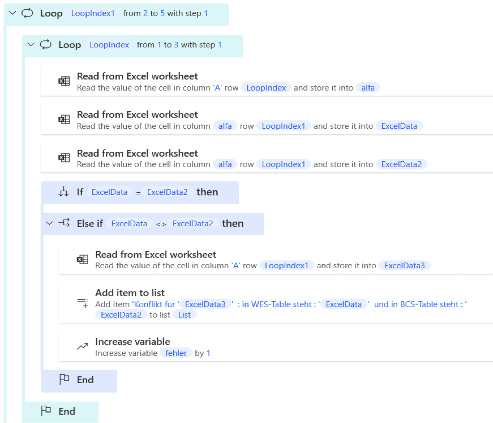
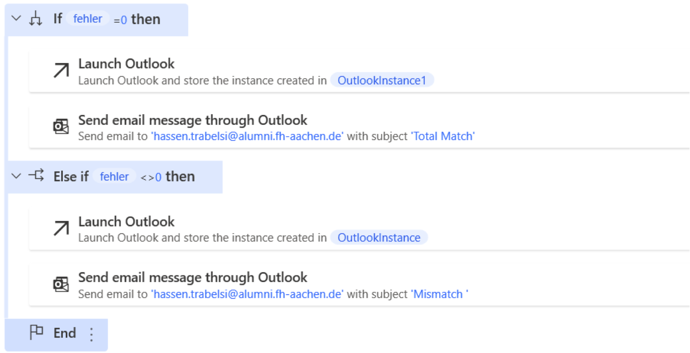

## Introduction

Throughout the course „Cloud-basierte Informationssysteme”, we managed to implement
a Use Case for the Factur Billing Solutions GmbH Company using Microsoft power Automate
in addition to other Cloud features. One of the cases (which is visualized in the
illustration below) that we were working on was creating a flow using Power Automate
Desktop to compare two excel files. In the Following, we will show you how you can
implement it using Power Automate Desktop.

First, we will start with a glimpse of the tool we will be using and its functionalities:

## Power Automate Desktop Overview

Power automate Desktop is a low-code automation tool that is a part of windows. It
is used to automate repetitive and manual daily Tasks. These tasks are built via
drag-and-drop capabilities, called actions, which enable sophisticated task development
without writing a line of code. The user can choose from actions for tasks involving
web browsers, Microsoft applications (like Excel), file systems etc.

### Examples of Automated Processes

#### Web browser task automation:

Power automate Desktop interacts with browsers nearly just like us and can do almost
anything we can do on a website like clicking on links, selecting from a menu or
type into a text box. In fact, while building the process the user can choose one
of the available actions : browser automation, interactivity actions, and input actions.

#### Data scraping and extraction:

Power automates Desktop can keep your critical data moving without the need for manual
tasks or custom script writing thanks to its sophisticated data extraction, transformation, and transport tools.
Power automate Desktop data extraction can be used with web browsers, email,
and databases along with excel, PDF, CSV filetypes.

#### Cloud Automation:

Power automate desktop solutions can be deployed on premise or in the cloud and can
connect to and centralize your systems and applications. It can streamline and automate
your entire environment, no matter where you are in your cloud migration process.
Automate integrates with cloud technologies such as amazon Web Services (AWS), Windows
Azure and Jenkins as well as any web service-based application.

### Difference between Power Automate Desktop and Power Automate Online

The main difference between Power Automate Desktop and Power Automate (online) is the
type of tasks they are designed to automate.

Power Automate Desktop is a desktop automation tool that is used to automate tasks
on a local computer. It allows users to record and replay tasks, create workflows
with a drag-and-drop interface, and use a wide range of pre-built actions and connectors
to automate various tasks on their computer.

On the other hand, Power Automate (online) is a cloud-based service that is used
to automate workflows between different applications and services. It allows users
to create workflows that connect to different apps and services, such as Microsoft
Office 365, Dropbox, Salesforce, and many more, and automate tasks such as notifications,
approvals, and data synchronization.

In summary, Power Automate Desktop is designed to automate tasks on a local computer,
while Power Automate (online) is designed to automate workflows between different
applications and services in the cloud.

## Comparing two Excel files

After presenting you Power automate Desktop and its functionalities we will now get
to the point of our Blog which is comparing two excel files using the previously
described tool.

The steps to follow:

1. Start by creating a new Power Automate Desktop flow.
   
1. Attach to the two running Excel tables to compare.
   This action allows us to connect to an already running Excel instance (in our
   case the two Excel files we want to compare) and automate tasks in that instance.
   
1. Initialize a Variable which holds for example the value “0” in case of total Match
   and the value “1” in case of a mismatch. Then initialize a List to store the messages
   to send in case of a mismatch.
   
1. Compare the 2 tables row by row and if a mismatch is detected increase the previously
   initialized variable and add the needed information regarding the mismatch to the
   list.
   Using the loops provided by the Power automate Desktop we can iterate through
   the tables in the two excel files and compare each row with another so we can fully
   compare the two files. For it to work properly, you can pass number of columns you
   want to compare when needed alongside the length of the tables.
   You can also use the if/else conditions to implement the comparing part and of course
   the action “Read from Excel worksheet” which will provide you the value of the current
   row in the loop.  
   In the illustration below you can see how it is implemented in the tool.
   
1. Once the comparing is done you can choose whether you want to display a message or send an email etc.
   To display a message, you can use the action “Display message” as the illustration shows.
   
   To send an email you can use the action below "Send email message through Outlook".
   In our case and as described in our SOLL-Process if the data matches, the accounting
   department will receive an email with the total match whereas if the data doesn't
   match, we will be sending an error message in an email to the head of department
   with all details about the mismatch(s).
   The illustration below illustrates the described process.
   

Finally, [this video](./compare_excel/vergleich_video.mp4)
demonstrates our task and how everything came all together at the end.

## Resources:

As some learning sources we used YouTube tutorials as well as the Microsoft documentation
for the Power automate Desktop tool. We also received assistance with our questions from our professor Christian Drumm,
who sometimes guided us and gave us some hints towards the adequate way of using the tool.

At the end, we hope that this tutorial can help you get a glimpse of the Power automate
desktop tool and its functionalities as well as the steps to comparing two Excel files using it.
