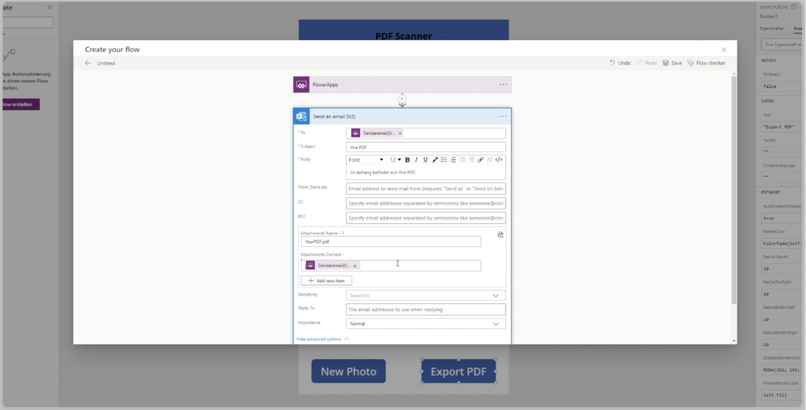
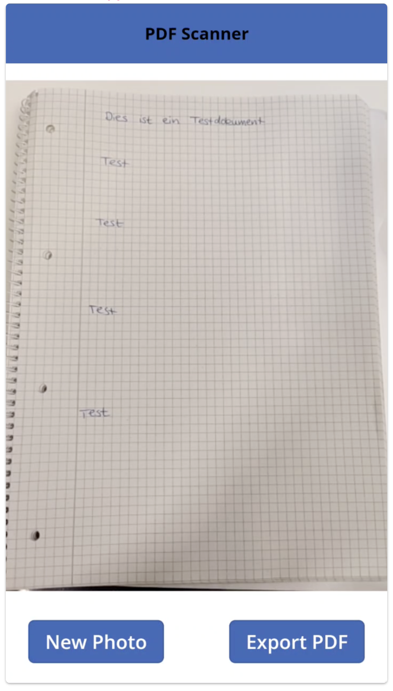

Microsoft Power Apps is a versatile tool that can help you automate and streamline
various tasks. In this blog post, we'll explore how to use Power Apps to take a picture
with your phone camera and generate a PDF, which will be sent via email. Here are
the steps to create this app:

## Setting up the Environment

The PDF feature in Power Apps is an experimental feature and needs to be enabled
before it can be used. Here are the steps to enable the PDF feature in Power Apps:

1.  In Power Apps, click on the "Settings" icon (gear icon) and select "Advanced settings".
1.  In the Advanced settings, scroll down to the "Experimental features" section.
1.  Look for the feature called "PDF generation" and toggle the switch to turn on the experimental feature.
1.  Click on the "Save" button to apply the changes.

## App implementation

1.  Open Power Apps and create a new app. Select the "Canvas" template.
1.  On the first screen, add a "Camera" control and a "Button" control. The "Camera"
    control will allow the user to take a picture, and the "Button" control will initiate
    the process of generating a PDF and sending it via email.
1.  Add a "PDF viewer" control to the screen. This control will display the PDF after it has been created.
1.  In the "OnSelect" property of the "Button" control, add the following code to generate the PDF:

    ```
    scssCopy codePDF(
        Camera1.Photo;
        "My PDF"
    )

    ```

    This code will generate a PDF from the picture taken using the "Camera" control and name the PDF "My PDF".

1.  To send the PDF as an email attachment, add an "Email" control to the screen. Configure the control by setting the "To" property to the user's email address and the "Subject" property to the desired email subject.
    This is how it looks like if you use the Outlook controller to send an e-mail.
    

1.  In the "OnSelect" property of the "Button" control, add the following code to generate the PDF and send it as an email attachment:

    ```
    phpCopy codePDF(
        Camera1.Photo;
        "Mein PDF"
    );
    Office365.SendEmailV2(
        User().Email;
        "Mein PDF";
        "Siehe angehängtes PDF";
        {attachments: [
            {
                name: "Mein PDF.pdf";
                contentBytes: PDF(
                    Camera1.Photo;
                    "Mein PDF"
                )
            }
        ]}
    )

    ```

    This code will generate a PDF from the picture taken using the "Camera" control
    and name the PDF "My PDF". The PDF will then be attached to an email and sent to
    the user's email address.

1.  Save the app and test it. When the user takes a picture using the "Camera" control and clicks the "Button" control, a PDF will be generated and displayed in the "PDF viewer" control. An email will also be sent to the user with the PDF attached.

### Using the Power App on Your Phone

To use the Power App on your phone, you need to download the Power Apps mobile app. Here are the steps to do this:

1.  Download the Power Apps mobile app from the App Store or Google Play Store.
1.  Open the app and sign in with your Microsoft account.
1.  Find the app that you created and open it.
1.  Take a picture using your phone camera.
1.  Click the "Button" control to generate the PDF and send it as an email attachment.

The finished app could look like this:


## Conclusion

In this blog post, we have explored how to create a Power App that allows the user to take a picture with their phone camera and generate a PDF, which will be sent via email. We have covered everything from adding a "Camera" control to the app to sending the PDF as an email attachment. With this app, users can easily generate PDFs from pictures they take with their phone and share them in a professional and convenient format.
