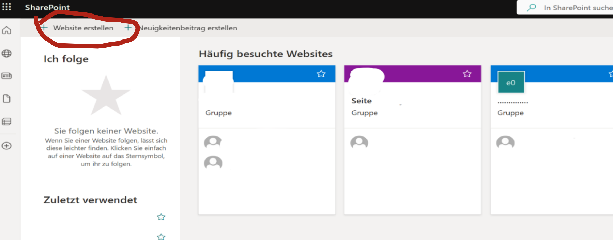
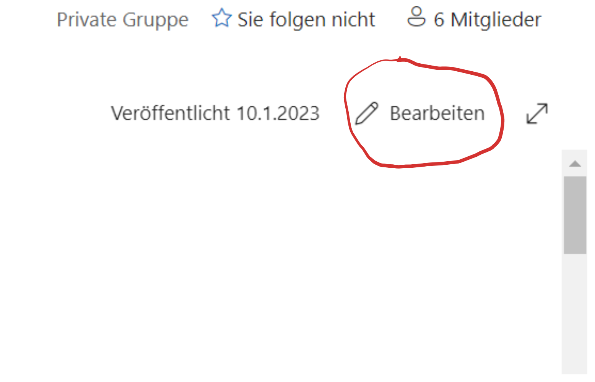
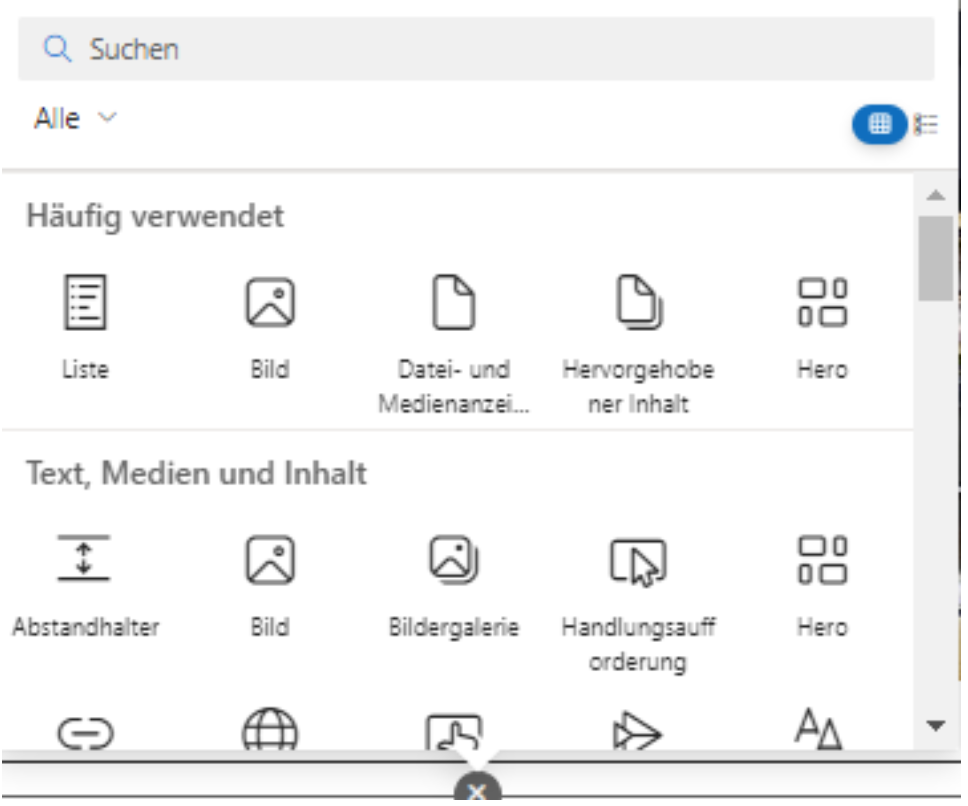
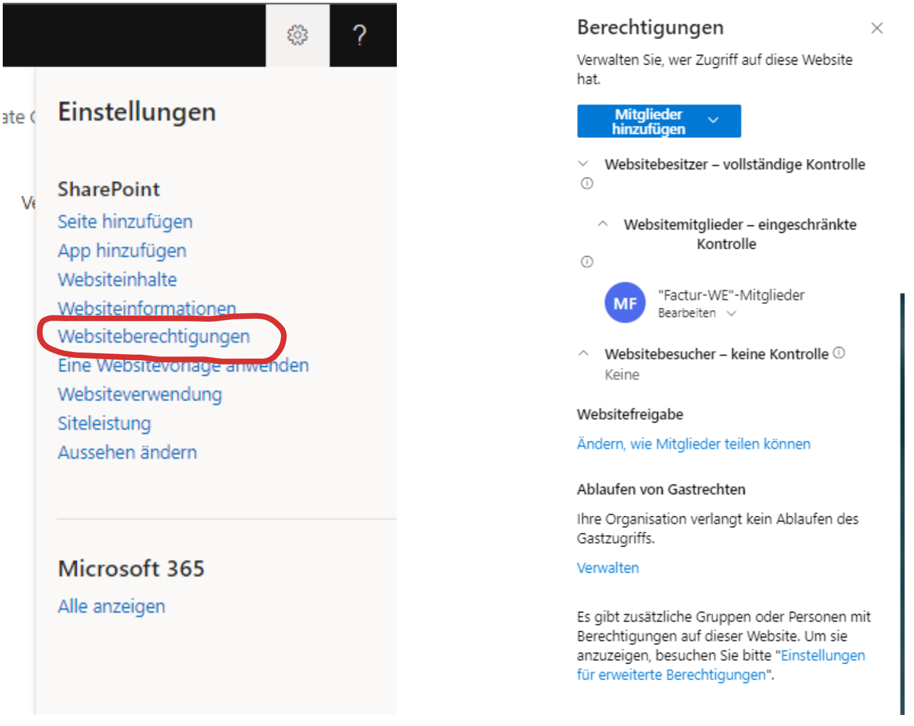

In dem Modul „Cloud-basierte Informationssysteme“ an der FH Aachen hatten wir die
Möglichkeit, einen Use-Case der Factur Billing Solutions GmbH mithilfe der Power
Automaten sowie vieler anderer Cloud-Lösungen von Microsoft zu bearbeiten. Das Ziel
dieses Cases war es, einen sehr aufwändigen manuellen Anmeldeprozess möglichst vollständig
zu automatisieren. Wir haben bei unserem Projekt unter anderem SharePoint-Online
genutzt und werden diesen Service im Folgenden vorstellen.

## Was ist SharePoint-Online?

SharePoint-Online ist eine Webanwendung von Microsoft zum Informationsaustausch und
zur Zusammenarbeit innerhalb eines Unternehmens. Es ist vergleichbar mit einem klassischen
Intranet, das jedoch in den Rechenzentren von Microsoft betrieben wird und daher
keine eigenen Rechenkapazitäten benötigt. SharePoint ermöglicht es den Benutzern
gemeinsam auf Dokumente und Inhalte zuzugreifen und diese gleichzeitig zu bearbeiten,
wodurch die Zusammenarbeit und Kommunikation im Team erleichtert werden. Außerdem
bietet es umfassende Sicherheits- und Verwaltungsfunktionen, um die Daten und Inhalte
des Unternehmens zu schützen. Zu den großen Vorteilen von SharePoint zählt die Integration
in vielen Microsoft 365-Programme wie Word, Teams oder Microsoft Power Automate,
wodurch ermöglicht wird Office-Dokumente einfach zu veröffentlichen oder bestimmte
Prozesse zu automatisieren, um somit einen hohen Mehrwert für das Unternehmen zu
bieten.

## Welche Funktionalität bietet SharePoint?

- **Dokumentenmanagement:** SharePoint ermöglicht es Benutzern, Dokumente in Bibliotheken
  zu speichern, die schnell zu durchsuchen und zu verwalten. Die Benutzer können zudem
  die Versionen von Dokumenten verfolgen und mit anderen Mitarbeitern zusammenzuarbeiten.
- **Zusammenarbeit und Kommunikation:** SharePoint bietet Funktionen wie Diskussionsforen,
  Nachrichtenboards und Soziale Netzwerke, die es Benutzern ermöglichen miteinander
  zu kommunizieren und zusammenzuarbeiten.
- **Intranet-Portal:** SharePoint kann als Intranet-Portal genutzt werden, welches
  den Benutzern ermöglicht auf wichtige Informationen, Dokumente und Anwendungen zuzugreifen.
- **Business-Intelligence-Lösungen:** SharePoint bietet ebenso eine Reihe von Tools
  für Business Intelligence an. Gemeint sind hierbei beispielsweise Dashboards, Berichte
  und Datenanalysen.
- **Suchfunktion:** SharePoint verfügt über eine Suchfunktion, die es Benutzern ermöglicht
  schnell und einfach Informationen auf den Websites zu finden.

## Wie ist SharePoint aufgebaut?

Das Intranet wird über individuell anpassbare Sites dargestellt. Dabei wird eine
große Auswahl an verschiedenen Elementen bereitgestellt. Zusätzlich zu diesen Anpassungen
können Kommentare unterhalb der Seiten hinzugefügt und die Anordnung der einzelnen
Elemente geändert werden. Die SharePoint-Sites können jederzeit verändert werden
und bei jeder neuen Veröffentlichung werden sie überschrieben.

Eine SharePoint Site lässt sich folgendermaßen aufbauen:

- Zuerst muss sich in das SharePoint-Konto einloggt und eine neue Website erstellen
  werden. Hierbei können die Vorlagen-Sites ausgewählt oder eigene Designs festgelegt
  werden.
  

- Im Anschluss können am rechten Rand über den Button „Bearbeiten“, Listen, Bilder,
  Dokumente und andere Inhalte zur SharePoint-Site hinzufügt werden. Unter diesem
  Punkt lassen sich auch Änderungen am Layout der Seite vornehmen, wobei die Seite
  beispielsweise in unterschiedliche Abschnitte unterteilt werden kann.
  
  
  

- Als nächstes sollten Sie die Rechte und Rollen der einzelnen Mitarbeiter festlegen,
  damit der Zugang oder die Änderungsmöglichkeiten ausschließlich bestimmten Personen
  vorbehalten ist. Dies können Sie rechts oben unter "Einstellungen" und "Websiteberechtigungen"
  nach Ihren Belieben einstellen.
  

- Nachdem alle Einstellungen vorgenommen wurden, kann die Seite nun veröffentlicht werden.
  

## Unser Fazit zu SharePoint

Zusammengefasst ist SharePoint eine vielseitige und leistungsstarke Plattform, die
es Unternehmen ermöglicht ihre Dokumente und Daten effizient zu verwalten, zu teilen
und zu schützen, während gleichzeitig die globale Zusammenarbeit und Kommunikation
im Team verbessert werden.
