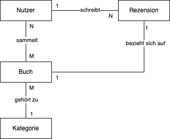
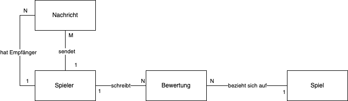

## ER-Modelle erstellen

Erstellen Sie ein ER-Modell in der Chen-Notation für folgenden Aufgaben.
Berücksichtigen Sie jeweils auch die Kardinalitäten der Relationen.

### Netflix

Modellieren Sie ein ER-Diagramm für Netflix: Kunden haben Abos und sehen Filme
oder Serien. Kunden geben Bewertungen ab. Serien haben Staffeln und Episoden.
Welche Entitäten und Beziehungen ergeben sich?

### Harry Potter - Zauberschule

Modellieren Sie Hogwarts: Schüler gehören einem Haus an und besuchen Kurse.
Kurse bestehen aus mehreren Zauberprüfungen. Lehrer unterrichten mehrere Kurse.
Jede Lehrer unterrichtet in einem Unterrichtsraum.

### Instagram

Modellieren Sie das Posting-System von Instagram: Nutzer posten Fotos, geben
Likes, folgen anderen Nutzern. Kommentare sind möglich.

### Super Mario Kart-Turnier

Modellieren Sie ein Turniersystem: Spieler treten in Rennen gegeneinander an,
nutzen Fahrzeuge, sammeln Punkte. Turniere bestehen aus mehreren Rennen.

### Online-Bestellung bei Amazon

Modellieren Sie ein Bestellung bei Amazon: Kunden bestellen Produkte, die von
Lieferanten geliefert werden. Eine Bestellung kann mehrere Produkte enthalten.
Produkte haben Kategorien. Kunden bewerten Produkte.

## ER-Modelle erweitern

### BookBase

BookBase ist eine Plattform für Bücherliebhaber. Nutzer können Bücher sammeln
und Rezensionen schreiben. Ein einfaches ER-Modell existiert bereits. Ihre
Aufgabe ist es, dieses Modell um zusätzliche Anforderungen zu erweitern.
Diskutieren Sie, welche Anforderungen sich nicht direkt durch das ER-Modell
abbilden lassen.

- Leselisten: Nutzer können Leselisten erstellen. Eine Leseliste kann mehrere
  Bücher enthalten.
- Folgen-Funktion: Nutzer können anderen Nutzern folgen.
- Rezensionen als hilfreich markieren: Nutzer können Rezensionen als hilfreich
  markieren.
- Ein Nutzer darf pro Buch nur eine Rezension schreiben.

### PlayVerse

Die Plattform PlayVerse vernetzt Spieler und ihre Spiele. Nutzer (Spieler)
können Spiele bewerten und sich Nachrichten schicken. Das aktuelle ER-Modell
bildet diese Grundfunktionen ab. Ihre Aufgabe ist es, das Modell funktional zu
erweitern.

Bitte erweitern Sie das ER-Modell um folgende Aspekte:

- Jedes Spiel wird von genau einem Entwicklerstudio entwickelt. Ein
  Entwicklerstudio kann mehrere Spiele veröffentlichen.
- Spieler können Clans beitreten. Ein Clan besteht aus mindestens zwei
  Spielern.
- Spiele haben mindestens eine Systemanforderung (z. B. RAM, Grafikkarte). Eine
  Systemanforderung kann zu mehreren Spielen gehören.
- Nachrichten können mehrere Anhänge (z. B. Screenshots) haben. Ein Nachricht
  darf maximal 10 Anhänge haben.

### ResearchNet

ResearchNet ist ein Netzwerk für Forschende. Es verwaltet wissenschaftliche
Artikel, ihre Autor\*innen und Präsentationen auf Konferenzen. Ein einfaches
ER-Modell liegt vor. Ziel ist es, weitere Anforderungen zu modellieren und
mögliche Einschränkungen zu diskutieren.

Bitte erweitern Sie das ER-Modell um folgende Aspekte:

- Ein Artikel kann zusätzlich in einem Journal erscheinen.
- Ein Journal gehört zu genau einem Verlag.
- Forschende können andere Artikel reviewen (Peer-Review).
- Forschende dürfen nicht ihre eigenen Artikel reviewen.
- Jeder Artikel kann mehrere Reviews haben.
- Jede Konferenz hat einen Austragungsort.
- Eine Konferenz kann mehrere Sponsoren haben.
- Jeder Artikel hat eine eindeutige DOI (Digital Object Identifier).

