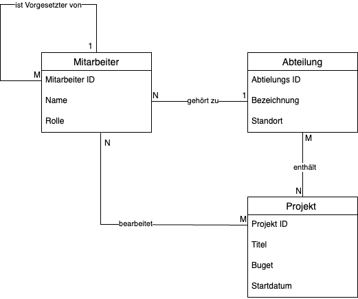

## Überführung eines ER-Modells in ein Relationenmodell

Überführen Sie die folgenden Entity-Relationship-Modelle (ER-Modell) in ein
Relationenmodell. Achten Sie dabei insbesondere auf die korrekte Auswahl von
Primärschlüsseln und markieren Sie die Beziehungen zwischen Primär- und
Fremdschlüsseln.

### Musikplattform „TuneZone“

User erstellen Playlists, fügen Lieder hinzu. Lieder können mehreren Genres
angehören und werden von Künstlern interpretiert.

### Unternehmensstruktur „BizOrg“

Mitarbeitende gehören zu Abteilungen, bearbeiten Projekte und sind ggf.
einander unterstellt.

### Hochschule „EduTrack“

Studierende belegen Module mit mehreren Prüfungen. Zu jeder Prüfung gibt es
eine Note. Für jedes Module gibt es eine Gesamtnote.

