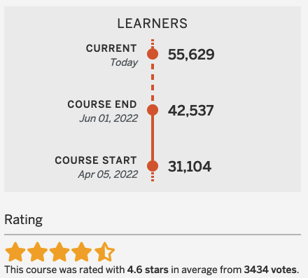

This is a archived version of the Python for Beginners MOOC. The course
was initially presented in April 2022 on [OpenSAP](https://open.sap.com).
When the OpenSAP platform was closed more than 55.600 learners participated
in the course and rated it 4,6 from 5 stars.

## Week 0

- [Welcome to Week 0](/teaching/python-mooc/week0_welcome_to_week_0)
- [Week 0 Unit 1: Welcome - How this cours works](/teaching/python-mooc/week0_unit1_welcome)
- [Week 0 Unit 2: Installing Python and Jupyter](/teaching/python-mooc/week0_unit2_installing_python_and_jupyter)
- [Week 0 Unit 3: How to use Jupyter Notebooks](/teaching/python-mooc/week0_unit3_how_to_use_jupyter)

## Week 1

- [Welcome to Week 1](week1_welcome_to_week_1)
- [Course Elements](week1_course_elements)
- [Week 1 Unit 1: First steps in Python](week1_unit1_first_steps_in_python)
- [Week 1 Unit 1: Self-test](week1_unit1_selftest)
- [Week 1 Unit 2: Using variables](week1_unit2_using_variables)
- [Week 1 Unit 2: Self-test](week1_unit2_selftest)
- [Week 1 Unit 3: Performing simple input and output](week1_unit3_performing_simple_input_and_output)
- [Week 1 Unit 3: Self-test](week1_unit3_selftest)
- [Week 1 Unit 3: Exercise](week1_unit_3_exercise)
- [Week 1 Unit 4: What is a data type?](week1_unit4_what_is_a_data_type)
- [Week 1 Unit 4: Self-test](week1_unit4_selftest)
- [Week 1 Unit 5: Using if statements](week1_unit5_using_if_statements)
- [Week 1 Unit 5: Self-test](week1_unit5_selftest)
- [Week 1 Unit 5: Exercise](week1_unit5_exercise)
- [Week 1 Unit 6: Using multiple if statements](week1_unit6_using_multiple_if_statements)
- [Week 1 Unit 6: Self-test](week1_unit6_selftest)
- [Week 1 Unit 7: Creating complex logical expressions](week1_unit7_creating_complex_expressions)
- [Week 1 Unit 7: Self-test](week1_unit7_selftest)
- [Week 1 Assignment (Part 1 - Questions)](week1_assignment_questions)
- [Week 1 Assignment (Part 2 - Exercise)](week1_assignment_exercise)
- [Week 1 Assignment Solution](week1_assignment_exercise_solution)
- [Week 1 Bonus Exercise](week1_bonus_exercise)
- [Week 1 Bonus Exercise Solution](week1_bonus_exercise_solution)
- [Week 1 Additional Learning Material](week1_additional_material)

## Week 2

- [Welcome to Week 2](welcome_to_week_2)
- [Week 2 Unit 1: What are lists in Python?](week2_unit1_lists_in_python)
- [Week 2 Unit 1: Self-test](week2_unit1_selftest)
- [Week 2 Unit 2: Using an index to access lists](week2_unit2_using_index)
- [Week 2 Unit 2: Self-test](week2_unit2_selftest)
- [Week 2 Unit 2: Exercise](week2_unit2_exercise)
- [Week 2 Unit 3: Important functions and methods for lists](week2_unit3_important_functions)
- [Week 2 Unit 3: Self-test](week2_unit3_selftest)
- [Week 2 Unit 4: Iterating using the for loop](week4_unit4_iteration_using_loop)
- [Week 2 Unit 4: Self-test](week2_unit4_selftest)
- [Week 2 Unit 4: Exercise](week2_unit4_exercise)
- [Week 2 Unit 5: Using ranges to create sequences of numbers](week2_unit5_using_ranges)
- [Week 2 Unit 5: Self-test](week2_unit5_selftest)
- [Week2 Unit 5: Exercise](week2_unit5_exercise)
- [Week 2 Unit 6: Sequences](week2_unit6_sequences)
- [Week 2 Unit 6: Self-test](week2_unit6_selftest)
- [Week 2 Unit 7: Slicing](week2_unit7_slicing)
- [Week 2 Unit 7: Self-test](week2_unit7_selftest)
- [Week 2 Unit 8: List comprehension](week2_unit8_list_comprehension)
- [Week 2 Unit 8: Self-test](week2_unit8_selftest)
- [Week 2 Assignment (Part 1 - Questions)](week2_assignment_questions)
- [Week 2 Assignment (Part 2 - Exercise)](week2_assignment_exercise)
- [Week 2 Assignment Solution](week2_assignment_exercise_solution)
- [Week 2 Bonus Exercise](week2_bonus_exercise)
- [Week 2 Bonus Exercise Solution](week2_bonus_exercise_solution)
- [Week 2 Additional Learning Material](week2_additional_material)

## Week 3

- [Welcome to Week 3](welcome_to_week3)
- [Week 3 Unit 1: What are tuples?](week3_unit1_tuples)
- [Week 3 Unit 1: Self-test](week3_unit1_selftest)
- [Week 3 Unit 1: Exercise](week3_unit1_exercise)
- [Week 3 Unit 2: What are dictionaries?](week3_unit2_dictionarys)
- [Week 3 Unit 2: Self-test](week3_unit2_selftest)
- [Week 3 Unit 2: Exercise](week3_unit2_exercise)
- [Week 3 Unit 3: When to use lists, dictionaries, and tuples](week3_unit3_list_dict_tuples)
- [Week 3 Unit 3: Self-test](week3_unit3_selftest)
- [Week 3 Unit 4: Safe dictionary access](week3_unit4_dict_access)
- [Week 3 Unit 4: Self-test](week3_unit4_selftest)
- [Week 3 Unit 5: Important functions and methods for complex data types](week3_unit5_important_funcs)
- [Week 3 Unit 5: Self-test](week3_unit5_selftest)
- [Week 3 Unit 6: While loop](week3_unit6_while_loop)
- [Week 3 Unit 6: Self-test](week3_unit6_selftest)
- [Week 3 Assignment (Part 1 - Questions)](week3_assignment_questions)
- [Week 3 Assignment (Part 2 - Exercise)](week3_assignment_exercise)
- [Week 3 Assignment Solution](week3_assignment_exercise_solution)
- [Week 3 Bonus Exercise](week3_bonus_exercise)
- [Week 3 Bonus Exercise Solution](week3_bonus_exercise_solution)
- [Week 3 Additional Learning Material](week3_additional_material)

## Week 4

- [Welcome to Week 4](welcome_to_week4)
- [Week 4 Unit 1: Motivation and definition](week4_unit1_motivation)
- [Week 4 Unit 1: Self-test](week4_unit1_selftest)
- [Week 4 Unit 2: Opening and closing files](week4_unit2_open_files)
- [Week 4 Unit 2: Self-test](week4_unit2_selftest)
- [Week 4 Unit 3: Reading data from files](week4_unit3_reading_data)
- [Week 4 Unit 3: Self-test](week4_unit3_selftest)
- [Week 4 Unit 3: Exercise](week4_unit3_exercise)
- [Week 4 Unit 4: Writing data to files](week4_unit4_writing_data)
- [Week 4 Unit 4: Self-test](week4_unit4_selftest)
- [Week 4 Unit 4: Exercise](week4_unit4_exercise)
- [Week 4 Unit 5: Formatting output ](week4_unit5_formatting_output)
- [Week 4 Unit 5: Self-test](week4_unit5_selftest)
- [Week 4 Unit 5: Exercise](week4_unit5_exercise)
- [Week 4 Unit 6: String methods](week4_unit6_string_methods)
- [Week 4 Unit 6: Self-test](week4_unit6_selftest)
- [Week 4 Assignment (Part 1 - Questions)](week4_assignment_questions)
- [Week 4 Assignment (Part 2 - Exercise)](week4_assignment_exercise)
- [Week 4 Assignment Solution](week4_assignment_exercise_solution)
- [Week 4 Bonus Exercise](week4_bonus_exercise)
- [Week 4 Bonus Exercise Solution](week4_bonus_exercise_solution)
- [Week 4 Additional Learning Material](week4_additional_material)

## Week 5

- [Welcome to Week 5](welcome_to_week5)
- [Week 5 Unit 1: Why are functions necessary?](week5_unit1_why_functions)
- [Week 5 Unit 1: Self-test](week5_unit1_selftest)
- [Week 5 Unit 2: Returning results from functions](week5_unit2_return_results)
- [Week 5 Unit 2: Self-test](week5_unit2_selftest)
- [Week 5 Unit 2: Exercise](week5_unit2_exercise)
- [Week 5 Unit 3: Adding parameters to functions](week5_unit3_adding_parameters)
- [Week 5 Unit 3: Self-test](week5_unit3_selftest)
- [Week 5 Unit 3: Exercise](week5_unit3_exercise)
- [Week 5 Unit 4: Visibility of variables](week5_unit4_visibility_of_vars)
- [Week 5 Unit 4: Self-test](week5_unit4_selftest)
- [Week 5 Unit 5: Combining functions](week5_unit5_combining_funtions)
- [Week 5 Unit 5: Self-test](week5_unit5_selftest)
- [Week 5 Unit 5: Exercise](week5_unit5_exercise)
- [Week 5 Unit 6: Methods vs. functions](week5_unit6_methods_vs_functions)
- [Week 5 Unit 6: Self-test](week5_unit6_selftest)
- [Week 5 Unit 7: Destructuring assignment](week5_unit7_destructing_assignment)
- [Week 5 Unit 7: Self-test](week5_unit7_selftest)
- [Week 5 Assignment (Part 1 - Questions)](week5_assignment_questions)
- [Week 5 Assignment (Part 2 - Exercise)](week5_assignment_exercise)
- [Week 5 Assignment Solution](week5_assignment_exercise_solution)
- [Week 5 Bonus Exercise](week5_bonus_exercise)
- [Week 5 Bonus Exercise Solution](week5_bonus_exercise_solution)
- [Week 5 Additional Learning Material](week5_additional_material)

## Week 6

- [Welcome to Week 6](welcome_to_week6)
- [Week 6 Unit 1: What are libraries?](week6_unit1_libraries)
- [Week 6 Unit 1: Self-test](week6_unit1_selftest)
- [Week 6 Unit 2: Importing libraries](week6_unit2_import_libraries)
- [Week 6 Unit 2: Self-test](week6_unit2_selftest)
- [Week 6 Unit 3: Math and statistics libraries](week6_unit3_math)
- [Week 6 Unit 3: Self-test](week6_unit3_selftest)
- [Week 6 Unit 3: Exercise](week6_unit3_exercise)
- [Week 6 Unit 4: Other standard libraries](week6_unit4_standard_libraries)
- [Week 6 Unit 4: Self-test](week6_unit4_selftest)
- [Week 6 Unit 5: Installing additional libraries](week6_unit5_installing_libraries)
- [Week 6 Unit 5: Self-test](week6_unit5_selftest)
- [Week 6 Unit 5: Exercise](week6_unit5_exercise)
- [Week 6 Unit 6: Examples of non-standard libraries](week6_unit6_example_libraries)
- [Week 6 Unit 6: Self-test](week6_unit6_selftest)
- [Week 6 Unit 7: Course summary](week6_unit7_summary)
- [Week 6 Assignment (Part 1 - Questions)](week6_assignment_questions)
- [Week 6 Assignment (Part 2 - Exercise)](week6_assignment_exercise)
- [Week 6 Assignment Solution](week6_assignment_exercise_solution)
- [Week 6 Bonus Exercise](week6_bonus_exercise)
- [Week 6 Bonus Exercise Solution](week6_bonus_exercise_solution)

## Finale Exam

- [Welcome to the Final Exam](welcome_to_finalexam)
- [Final Exam (Part 1 - Questions)](finalexam_questions)
