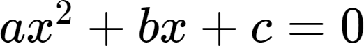
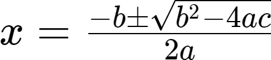
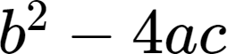

A [quadratic equation](https://en.wikipedia.org/wiki/Quadratic_equation) is an equation that can be written as

<br>

In this equation x represents an unknown number, and a, b, and c are representing known numbers. Possible solutions for a given quadratic equation can be calculated by the formula

<br>

The expression  is called the [discriminant](https://en.wikipedia.org/wiki/Quadratic_equation#Discriminant). Using the discriminant makes it is easy to check the number of solutions for a given quadratic equation:

+ If the discriminant is 0, the quadratic equation has exactly one real solution.
+ If the discriminant is > 0, the quadratic equation has two real solutions.
+ f the discriminant is < 0, the quadratic equation has two complex solutions.

Write a program that asks the user for the numbers a, b and c. The program should then print out how many solutions the quadratic equation has.

Below is an example execution of the program:

```Py
Please enter the value of a: 4
Please enter the value of b: 2
Please enter the value of c: -2

The quadratic equation has 2 real solutions.
```
Here is an another example execution of the program:

```Py
Please enter the value of a: 1
Please enter the value of b: 2
Please enter the value of c: 3

The quadratic equation has 2 complex solutions.
```

And here is yet another example execution of the program:

```Py
Please enter the value of a: 1
Please enter the value of b: 2
Please enter the value of c: 1

The quadratic equation has 1 real solution.
```

---

[< Previous unit](/teaching/python-mooc/week1_assignment_exercise_solution) | [Next unit >](/teaching/python-mooc/week1_bonus_exercise_solution) |
[Course Overview](/teaching/python-mooc)